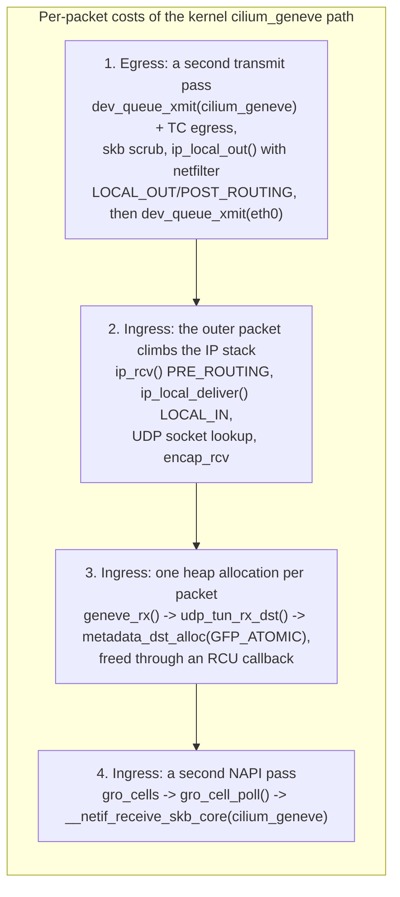
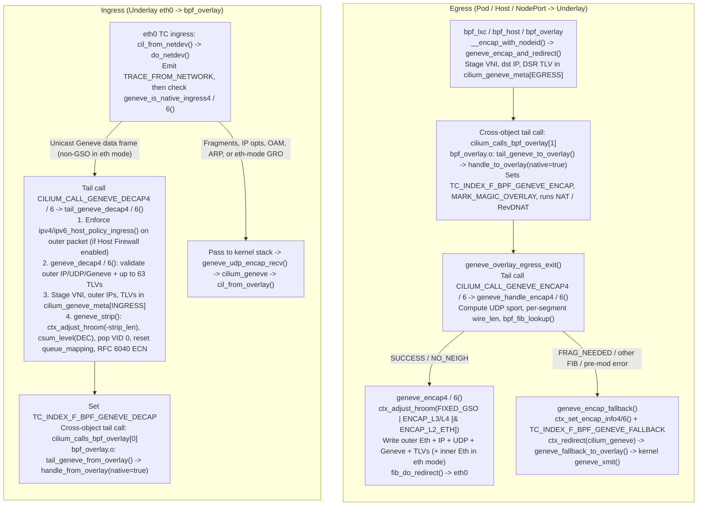

# CFP-XXXXX: Native eBPF Geneve Datapath

**SIG:** SIG-Datapath ([View all current SIGs](https://docs.cilium.io/en/stable/community/community/#all-sigs))

**Begin Design Discussion:** 2026-10-01

**Cilium Release:** 1.21

**Authors:** Kevin Wang <kevixw@gmail.com>

**Status:** Draft

**Related Issue:** https://github.com/cilium/cilium/issues/XXXXX <!-- TODO: file CFP issue; rename file to CFP-<issue>-bpf-geneve-datapath.md -->

**Implementation:** https://github.com/cilium/cilium/pull/49206

## Summary

In tunnel routing mode with `tunnelProtocol=geneve`, Cilium currently hands
every overlay packet to the kernel `cilium_geneve` device (`collect_md` mode).
This CFP proposes an opt-in (beta) mode, `bpf.geneve.enabled`, in which
Cilium's TC programs on the underlay devices build and strip the Geneve
headers themselves and redirect straight to the underlay (egress) or straight
into the existing `bpf_overlay` ingress logic (ingress). The default `eth`
inner mode (`bpf.geneve.innerProtocol=eth`) produces the same wire format as
the kernel path, so nodes can be switched one at a time. `cilium_geneve` stays
configured and handles every packet the native path does not take (`eth`-mode
GRO aggregates on ingress, overlay multicast, non-IP inner frames such as ARP,
packets exceeding the outer route MTU, and outer Geneve packets decrypted on
`cilium_wg0`), so enabling the feature never drops traffic the kernel path
would deliver. An optional `ip` inner mode (`bpf.geneve.innerProtocol=ip`)
omits the 14-byte inner Ethernet header on homogeneous clusters (increasing pod
route MTU by 14 bytes) and passes `BPF_F_ADJ_ROOM_DECAP_L4_UDP` on ingress
when supported by the kernel (`HAVE_DECAP_L4_UDP`).

In comparative benchmarks (`contrib/scripts/benchmark-geneve-bpf.sh`, 5
iterations rotating mode order on a 4-node GCE VM cluster with `Kernel Geneve`
as the baseline and mode switches performed solely by flipping `cilium-config`
against the same Cilium image), **BPF Geneve (`eth` mode)** and **BPF Geneve
(`ip` mode)** reduce 8-stream TCP combined node `softirq` CPU by `-24.5%`
(`152.8%` and `152.9%` vs. `202.5%` in Kernel Geneve), increasing throughput
per `softirq` CPU by `+25.8%` (`eth`) and `+34.1%` (`ip`, `+6.6%` over `eth`).
Across packet-rate and latency workloads on GCE VMs, **BPF Geneve (`eth`)** and
**BPF Geneve (`ip`)** improve unlimited 64-byte UDP packet rate by `+78.0%` and
`+35.9%`, 512-byte UDP throughput by `+35.6%` and `+66.8%` (`+23.0%` `ip` vs.
`eth`), 1380-byte UDP throughput by `+46.4%` and `+73.5%` (`+18.5%` `ip` vs.
`eth`), 128-byte `TCP_NODELAY` throughput by `+1.1%` and `+8.0%`, `ClusterIP`
service throughput by `+5.1%` and `+5.7%`, and 1360-byte ICMP echo mean RTT by
`-11.4%` (`eth`) and `-16.5%` (`ip`, `-19.1%` p99 RTT vs. Kernel Geneve). On a
3-node Kind cluster, **BPF Geneve (`eth`)** improves 8-stream TCP throughput by
`+5.8%` (`+16.3%` per `softirq` CPU), 128-byte `TCP_NODELAY` throughput by
`+18.4%`, unlimited 64-byte UDP packet rate by `+17.9%`, and 64-byte ICMP echo
mean RTT by `-20.2%`.

## Motivation

> [!NOTE]
> Every Linux kernel link in this document points to the **v6.18** tag of
> [`torvalds/linux`](https://github.com/torvalds/linux/tree/v6.18) (commit
> `7d0a66e4bb9081d75c82ec4957c50034cb0ea449`), and line numbers are from that
> tree. Cilium supports kernels down to 5.10. Where older kernels spell
> something differently the text says so; the behaviour described is the same
> on all of them.

### Background: the `cilium_geneve` (`collect_md`) path today

Since Linux 4.3, one Geneve device can serve every remote peer and VNI if it is
created in *external* (`collect_md`) mode: `ip link add cilium_geneve type
geneve external`, or the netlink attribute
[`IFLA_GENEVE_COLLECT_METADATA`, which sets `cfg->collect_md = true`](https://github.com/torvalds/linux/blob/v6.18/drivers/net/geneve.c#L1546-L1552).
In this mode the device has no fixed tunnel parameters. Each packet carries its
own tunnel key (outer addresses, VNI, TLV options) in a
[`struct metadata_dst`](https://github.com/torvalds/linux/blob/v6.18/include/net/dst_metadata.h#L33-L42)
attached to
[`skb->_skb_refdst`](https://github.com/torvalds/linux/blob/v6.18/include/linux/skbuff.h#L922).
Cilium creates `cilium_geneve` this way and attaches `cil_from_overlay` /
`cil_to_overlay` from `bpf_overlay.c` to it.

**Egress** (pod → remote node):

1. `bpf_lxc` (`bpf_host` for host traffic) decides to tunnel the packet. It
   calls
   [`bpf_skb_set_tunnel_key()`](https://github.com/torvalds/linux/blob/v6.18/net/core/filter.c#L4824)
   and
   [`bpf_skb_set_tunnel_opt()`](https://github.com/torvalds/linux/blob/v6.18/net/core/filter.c#L4905).
   - `bpf_skb_set_tunnel_key()` takes the **per-CPU** scratch object
     [`md_dst`](https://github.com/torvalds/linux/blob/v6.18/net/core/filter.c#L4822)
     ([`this_cpu_ptr(md_dst)`](https://github.com/torvalds/linux/blob/v6.18/net/core/filter.c#L4827)).
     It then
     [replaces the skb's dst with that object](https://github.com/torvalds/linux/blob/v6.18/net/core/filter.c#L4856-L4858)
     and
     [sets the tunnel flags](https://github.com/torvalds/linux/blob/v6.18/net/core/filter.c#L4864-L4872).
   - `bpf_skb_set_tunnel_opt()`
     [copies the Geneve TLVs into `info->options[]`](https://github.com/torvalds/linux/blob/v6.18/net/core/filter.c#L4917-L4918).
2. The program returns
   [`bpf_redirect(cilium_geneve_ifindex, 0)`](https://github.com/torvalds/linux/blob/v6.18/net/core/filter.c#L2536).
   The kernel resolves this in
   [`skb_do_redirect()`](https://github.com/torvalds/linux/blob/v6.18/net/core/filter.c#L2502) →
   [`__bpf_redirect()`](https://github.com/torvalds/linux/blob/v6.18/net/core/filter.c#L2200) →
   [`__bpf_tx_skb()` → `dev_queue_xmit()`](https://github.com/torvalds/linux/blob/v6.18/net/core/filter.c#L2138-L2153).
   That is a full
   [`__dev_queue_xmit()`](https://github.com/torvalds/linux/blob/v6.18/net/core/dev.c#L4670)
   pass on the *virtual* device, including its TC egress hook, where
   `cil_to_overlay` runs.
3. The device's transmit routine,
   [`geneve_xmit()`](https://github.com/torvalds/linux/blob/v6.18/drivers/net/geneve.c#L1026),
   [reads the metadata back with `skb_tunnel_info()`](https://github.com/torvalds/linux/blob/v6.18/drivers/net/geneve.c#L1032-L1042).
   It then calls
   [`geneve_xmit_skb()`](https://github.com/torvalds/linux/blob/v6.18/drivers/net/geneve.c#L820)
   (IPv4) or
   [`geneve6_xmit_skb()`](https://github.com/torvalds/linux/blob/v6.18/drivers/net/geneve.c#L933)
   (IPv6). These:
   - look up the outer route with
     [`udp_tunnel_dst_lookup()`](https://github.com/torvalds/linux/blob/v6.18/drivers/net/geneve.c#L848-L852)
     /
     [`udp_tunnel6_dst_lookup()`](https://github.com/torvalds/linux/blob/v6.18/drivers/net/geneve.c#L960-L964);
   - push the Geneve header in
     [`geneve_build_skb()`](https://github.com/torvalds/linux/blob/v6.18/drivers/net/geneve.c#L783-L796);
   - hand the packet to
     [`udp_tunnel_xmit_skb()`](https://github.com/torvalds/linux/blob/v6.18/drivers/net/geneve.c#L924-L928)
     /
     [`udp_tunnel6_xmit_skb()`](https://github.com/torvalds/linux/blob/v6.18/drivers/net/geneve.c#L1016-L1021).
4. [`iptunnel_xmit()`](https://github.com/torvalds/linux/blob/v6.18/net/ipv4/ip_tunnel_core.c#L50-L91):
   - [scrubs the skb](https://github.com/torvalds/linux/blob/v6.18/net/ipv4/ip_tunnel_core.c#L61);
   - builds the outer IPv4 header and
     [selects its IP ID](https://github.com/torvalds/linux/blob/v6.18/net/ipv4/ip_tunnel_core.c#L82);
   - sends the packet through the local output path with
     [`ip_local_out()`](https://github.com/torvalds/linux/blob/v6.18/net/ipv4/ip_tunnel_core.c#L84).
     This means netfilter
     [`NF_INET_LOCAL_OUT`](https://github.com/torvalds/linux/blob/v6.18/net/ipv4/ip_output.c#L120-L122)
     and
     [`NF_INET_POST_ROUTING`](https://github.com/torvalds/linux/blob/v6.18/net/ipv4/ip_output.c#L438-L441),
     neighbour output, and a **second** `__dev_queue_xmit()`, this time on the
     underlay device (`eth0`), where `cil_to_netdev` runs.

   For IPv6 the equivalent is
   [`ip6tunnel_xmit()` → `ip6_local_out()`](https://github.com/torvalds/linux/blob/v6.18/include/net/ip6_tunnel.h#L154-L162).

**Ingress** (remote node → pod):

1. The frame arrives on `eth0`.
   - GRO runs first. The Geneve socket registers
     [`geneve_gro_receive()`](https://github.com/torvalds/linux/blob/v6.18/drivers/net/geneve.c#L621)
     on the tunnel port, so
     [`udp4_gro_receive()`](https://github.com/torvalds/linux/blob/v6.18/net/ipv4/udp_offload.c#L874-L899)
     →
     [`udp_gro_receive()`](https://github.com/torvalds/linux/blob/v6.18/net/ipv4/udp_offload.c#L784-L851)
     merges consecutive segments of an inner TCP flow into one aggregate.
   - `cil_from_netdev` (TC ingress on `eth0`) then sees the *outer* packet and
     passes it to the IP stack:
     [`ip_rcv()`](https://github.com/torvalds/linux/blob/v6.18/net/ipv4/ip_input.c#L564-L576)
     (`NF_INET_PRE_ROUTING`) →
     [`ip_local_deliver()`](https://github.com/torvalds/linux/blob/v6.18/net/ipv4/ip_input.c#L248-L263)
     (`NF_INET_LOCAL_IN`) → UDP socket lookup →
     [`udp_queue_rcv_one_skb()`](https://github.com/torvalds/linux/blob/v6.18/net/ipv4/udp.c#L2375).
   - That function hands packets for encapsulation sockets to
     [`encap_rcv()`](https://github.com/torvalds/linux/blob/v6.18/net/ipv4/udp.c#L2406-L2414),
     which for Geneve is
     [`geneve_udp_encap_recv()`](https://github.com/torvalds/linux/blob/v6.18/drivers/net/geneve.c#L367).
2. `geneve_udp_encap_recv()`
   [finds the `collect_md` device](https://github.com/torvalds/linux/blob/v6.18/drivers/net/geneve.c#L192-L200),
   [pulls the outer headers](https://github.com/torvalds/linux/blob/v6.18/drivers/net/geneve.c#L401-L402)
   and calls
   [`geneve_rx()`](https://github.com/torvalds/linux/blob/v6.18/drivers/net/geneve.c#L224).
   In `collect_md` mode, `geneve_rx()`:
   - [allocates a new `metadata_dst` with `udp_tun_rx_dst()`](https://github.com/torvalds/linux/blob/v6.18/drivers/net/geneve.c#L240-L242),
     which calls
     [`ip_tun_rx_dst()`](https://github.com/torvalds/linux/blob/v6.18/include/net/dst_metadata.h#L218-L233)
     →
     [`tun_rx_dst()`](https://github.com/torvalds/linux/blob/v6.18/include/net/dst_metadata.h#L140-L151)
     (via [`udp_tun_rx_dst()`](https://github.com/torvalds/linux/blob/v6.18/net/ipv4/udp_tunnel_core.c#L207-L227));
   - [copies the TLV options into it](https://github.com/torvalds/linux/blob/v6.18/drivers/net/geneve.c#L248-L252);
   - [attaches it to the skb](https://github.com/torvalds/linux/blob/v6.18/drivers/net/geneve.c#L264-L265);
   - [queues the packet on the device's `gro_cells`](https://github.com/torvalds/linux/blob/v6.18/drivers/net/geneve.c#L329).
3. [`gro_cells_receive()`](https://github.com/torvalds/linux/blob/v6.18/net/core/gro_cells.c#L14-L53)
   adds the skb to a per-CPU backlog and
   [schedules a NAPI instance](https://github.com/torvalds/linux/blob/v6.18/net/core/gro_cells.c#L42-L44).
   Later,
   [`gro_cell_poll()`](https://github.com/torvalds/linux/blob/v6.18/net/core/gro_cells.c#L57-L76)
   re-injects the packet with `napi_gro_receive()`. The packet therefore makes
   a second `__netif_receive_skb_core()` pass, this time on `cilium_geneve`,
   whose
   [TC ingress hook](https://github.com/torvalds/linux/blob/v6.18/net/core/dev.c#L4388-L4450)
   runs `cil_from_overlay`.
4. `cil_from_overlay` reads the key and options back with
   [`bpf_skb_get_tunnel_key()`](https://github.com/torvalds/linux/blob/v6.18/net/core/filter.c#L4709)
   and
   [`bpf_skb_get_tunnel_opt()`](https://github.com/torvalds/linux/blob/v6.18/net/core/filter.c#L4788).
   Both reach the attached `metadata_dst` through
   [`skb_tunnel_info()`](https://github.com/torvalds/linux/blob/v6.18/include/net/dst_metadata.h#L54-L70).
   When the skb is finally consumed:
   - [`skb_dst_drop()`](https://github.com/torvalds/linux/blob/v6.18/include/net/dst.h#L275-L281)
     →
     [`dst_release()`](https://github.com/torvalds/linux/blob/v6.18/net/core/dst.c#L165-L179)
     drops the last reference;
   - destruction is
     [deferred to an RCU callback](https://github.com/torvalds/linux/blob/v6.18/net/core/dst.c#L177);
   - that callback ends in
     [`metadata_dst_free()`](https://github.com/torvalds/linux/blob/v6.18/net/core/dst.c#L118-L119)
     →
     [`kfree()`](https://github.com/torvalds/linux/blob/v6.18/net/core/dst.c#L316).

### Per-packet costs of the kernel path

`collect_md` removed the need for one netdev per peer. Every packet still pays
for the virtual device, though, and Cilium cannot tune these costs away:



1. **Egress: a second transmit pass for every packet.** The packet goes through
   `__dev_queue_xmit()` and the TC egress hook on `cilium_geneve`. The driver
   then scrubs the skb and re-enters the IP output path, including netfilter
   `LOCAL_OUT` and `POST_ROUTING` for the outer packet (and a conntrack lookup
   for the outer UDP flow when `nf_conntrack` is loaded). Only after that
   does the packet reach `__dev_queue_xmit()` on `eth0`. On the native path,
   the program that tunnels the packet builds the outer headers itself and
   redirects straight to `eth0`. Only the `eth0` half of the chain remains.
2. **Ingress: the outer packet climbs the IP stack.** Each Geneve packet is
   processed as a local UDP datagram: IP receive, netfilter `PRE_ROUTING` and
   `LOCAL_IN`, UDP socket lookup and the encapsulation callback. All of this
   happens before the Geneve driver even looks at it.
3. **Ingress: one heap allocation per packet.** In `collect_md` mode the
   receive side has no per-device tunnel key to point to, so it allocates one
   for every packet:

   ```c
   /* include/net/dst_metadata.h, v6.18 L140-L151 */
   static inline struct metadata_dst *tun_rx_dst(int md_size)
   {
           struct metadata_dst *tun_dst;

           tun_dst = metadata_dst_alloc(md_size, METADATA_IP_TUNNEL, GFP_ATOMIC);
           if (!tun_dst)
                   return NULL;

           tun_dst->u.tun_info.options_len = 0;
           tun_dst->u.tun_info.mode = 0;
           return tun_dst;
   }
   ```

   [`metadata_dst_alloc()`](https://github.com/torvalds/linux/blob/v6.18/net/core/dst.c#L292-L305)
   is a `kmalloc()` sized by the TLV bytes in the packet (`gnvh->opt_len * 4`,
   [passed in by `geneve_rx()`](https://github.com/torvalds/linux/blob/v6.18/drivers/net/geneve.c#L240-L242)).
   It is freed through the RCU-deferred path described above. The native path
   keeps the same information in a per-CPU BPF array slot while a tail-call
   chain runs, and allocates nothing.
4. **Ingress: a second NAPI pass.** After `geneve_rx()`, the packet waits in
   the per-CPU `gro_cells` backlog. It is then received a second time on
   `cilium_geneve`, where `cil_from_overlay` runs. The native path strips the
   outer headers in `cil_from_netdev` on `eth0` and tail-calls straight into
   the `bpf_overlay` ingress logic. The `gro_cells` pass does not happen.

Two caveats:

* **Route lookup.** Neither path caches the outer route. The kernel's
  per-tunnel `dst_cache` is never used for Cilium's packets: the BPF helper
  always marks the key `IP_TUNNEL_NOCACHE_BIT`, and `cil_to_overlay` sets
  `skb->mark` (see
  [Key Question: Should the outer route be cached in BPF?](#key-question-should-the-outer-route-be-cached-in-bpf)).
  The native path likewise calls `bpf_fib_lookup()` for every packet.
* **GRO aggregates.** GRO on `eth0` merges an inner TCP stream into Geneve
  aggregates before `cil_from_netdev` runs. In the default `eth` inner mode,
  released kernels cannot strip the outer headers from such an aggregate in
  BPF. Doing so would leave `SKB_GSO_UDP_TUNNEL` set. These aggregates
  therefore keep using `cilium_geneve`
  ([Impact: GRO aggregates keep using the kernel device in `eth` mode](#impact-gro-aggregates-keep-using-the-kernel-device-in-eth-mode)).
  The ingress savings apply to packets that GRO did not merge, for example
  request/response traffic and inner UDP. Egress savings apply to all traffic,
  GSO included.

XDP programs cannot use the kernel's tunnel-metadata API at all. The four
tunnel helpers are registered only for TC (`cls_act`) and LWT programs
([`tc_cls_act_func_proto()`](https://github.com/torvalds/linux/blob/v6.18/net/core/filter.c#L8273-L8280)),
and
[`xdp_func_proto()`](https://github.com/torvalds/linux/blob/v6.18/net/core/filter.c#L8370-L8427)
has no `BPF_FUNC_skb_{get,set}_tunnel_{key,opt}` cases.
[`struct xdp_md`](https://github.com/torvalds/linux/blob/v6.18/include/uapi/linux/bpf.h#L6524-L6533)
is not backed by an skb, so there is nowhere to attach a `metadata_dst`. This
proposal does not change Cilium's XDP programs. Decapsulation in XDP is listed
under [Future Milestones](#future-milestones) and would build on the Geneve
header code introduced here.

## Goals

* Encapsulate and decapsulate Geneve in Cilium's TC programs for pod,
  host and NodePort traffic in tunnel routing mode, reusing the existing
  `bpf_overlay` ingress/egress pipelines instead of duplicating policy, NAT,
  load-balancing and tracing logic.
* Wire compatibility with the kernel `cilium_geneve` path in the default
  `eth` inner mode (same Geneve header, options, VNI semantics, outer UDP
  source-port derivation, TTL, ECN handling and DF bit), so that native and
  kernel nodes interoperate during rollout and rollback.
* Never drop a packet that the kernel path would deliver: anything the native
  path cannot handle before modifying the packet is handed to `cilium_geneve`
  unchanged.
* No behaviour change while the feature is disabled (the default); BPF code is
  compiled only with `ENABLE_BPF_GENEVE`.
* Observability parity: the same Hubble trace points as the kernel path, three
  new drop reasons for malformed Geneve, and the new maps in `cilium-bugtool`.
* Optional `ip` inner mode for homogeneous clusters on kernels that support
  `BPF_F_ADJ_ROOM_DECAP_L4_UDP`.

## Non-Goals

* Removing or replacing the kernel `cilium_geneve` device; it remains the
  fallback and the path for multicast, GRO aggregates (`eth` mode) and
  traffic received over WireGuard.
* VXLAN support (see Future Milestones).
* Decapsulation in XDP (see Future Milestones).
* Changing defaults: the feature is opt-in and beta.
* Changing how IPsec or WireGuard encrypt overlay traffic (both continue to
  key on `MARK_MAGIC_OVERLAY` in `cil_to_netdev`; see Interactions with Other
  Features).
* Interoperability with non-Cilium Geneve endpoints beyond what the kernel
  path offers today.

## Proposal

### Overview

When `bpf.geneve.enabled=true` (`--enable-bpf-geneve=true`), Cilium compiles its
TC programs with `ENABLE_BPF_GENEVE` and handles Geneve encapsulation and
decapsulation directly in BPF while keeping the kernel `cilium_geneve` device
configured as a fallback:



### Egress

1. **Staging in `geneve_encap_and_redirect()`.** Every TC tunnel encapsulation
   site funnels through [`__encap_with_nodeid()`](https://github.com/ql-owo-lp/cilium/blob/google-geneve-datapath/bpf/lib/encap.h#L19-L61)
   in `bpf/lib/encap.h`. After emitting the usual `TRACE_TO_OVERLAY` notification,
   `#if defined(ENABLE_BPF_GENEVE) && __ctx_is == __ctx_skb` calls
   [`geneve_encap_and_redirect()`](https://github.com/ql-owo-lp/cilium/blob/google-geneve-datapath/bpf/lib/geneve_encap.h#L72-L114) instead of
   `ctx_set_encap_info4/6()`. That helper writes the outer address family,
   24-bit VNI (`get_tunnel_id(seclabel)`, or the VTEP VNI when applicable),
   remote tunnel endpoint IPv4/IPv6 address, and optional DSR TLV bytes into
   `cilium_geneve_meta[GENEVE_META_EGRESS]`, stamps `meta->magic = GENEVE_META_MAGIC`,
   and tail-calls slot `GENEVE_CALL_TO_OVERLAY` (`1`) of `cilium_calls_bpf_overlay`.
2. **Running the `bpf_overlay` egress pipeline (`tail_geneve_to_overlay`).**
   Slot `1` of `cilium_calls_bpf_overlay` enters
   [`tail_geneve_to_overlay()`](https://github.com/ql-owo-lp/cilium/blob/google-geneve-datapath/bpf/bpf_overlay.c#L797-L801) in
   `bpf/bpf_overlay.c`, which calls
   [`handle_to_overlay(ctx, /*native=*/true)`](https://github.com/ql-owo-lp/cilium/blob/google-geneve-datapath/bpf/bpf_overlay.c#L646-L744):
   - It clears `TC_INDEX_F_BPF_GENEVE_DECAP` (so hairpinned overlay packets do
     not carry a stale ingress marker), reads the staged VNI from
     `cilium_geneve_meta[GENEVE_META_EGRESS]`, derives `src_sec_identity`, sets
     `TC_INDEX_F_BPF_GENEVE_ENCAP` (`ctx_bpf_geneve_encap_set(ctx)`), and marks
     the packet with `set_identity_mark(ctx, src_sec_identity, MARK_MAGIC_OVERLAY)`.
   - It skips `edt_sched_departure()` when `native == true`. Native egress mostly
     enters from TC ingress on a pod veth (`bpf_lxc`), where writing `skb->tstamp`
     clears `skb->tstamp_type`
     ([`bpf_convert_tstamp_write()`](https://github.com/torvalds/linux/blob/v6.18/net/core/filter.c#L9612-L9640))
     and the subsequent redirect to the physical device calls
     [`skb_clear_tstamp()`](https://github.com/torvalds/linux/blob/v6.18/net/core/filter.c#L2224)
     ([and on `BPF_F_NEIGH` redirect](https://github.com/torvalds/linux/blob/v6.18/net/core/filter.c#L2325)),
     while `edt_get_aggregate()` consumes `ctx->queue_mapping`. Leaving EDT to
     `cil_to_netdev` on the physical underlay device preserves the aggregate in
     `queue_mapping` and schedules the departure timestamp once on the transmit
     device, just as in native-routing mode.
   - It then runs `handle_nat_fwd()` (ClusterMesh rev-SNAT, NodePort SNAT, and
     Geneve DSR reverse-DNAT in `bpf/lib/nodeport_egress.h`).
3. **Intercepting pipeline exit (`geneve_overlay_egress_exit`).** Every
   `CTX_ACT_OK` exit of the to-overlay pipeline — the end of `handle_to_overlay()`
   (https://github.com/ql-owo-lp/cilium/blob/google-geneve-datapath/bpf/bpf_overlay.c#L735-L738) and the ends of
   `tail_handle_nat_fwd_ipv4/6()` and `tail_handle_snat_fwd_ipv4/6()` in
   [`bpf/lib/nodeport_egress.h`](https://github.com/ql-owo-lp/cilium/blob/google-geneve-datapath/bpf/lib/nodeport_egress.h#L159-L161) — passes its
   return value through
   [`geneve_overlay_egress_exit()`](https://github.com/ql-owo-lp/cilium/blob/google-geneve-datapath/bpf/lib/geneve_encap.h#L176-L197). For
   packets with `TC_INDEX_F_BPF_GENEVE_ENCAP` set, `CTX_ACT_OK` is turned into an
   internal tail call to `CILIUM_CALL_GENEVE_ENCAP4` (`50`) or
   `CILIUM_CALL_GENEVE_ENCAP6` (`51`) inside `bpf_overlay.o`
   ([`tail_geneve_encap4()` / `tail_geneve_encap6()`](https://github.com/ql-owo-lp/cilium/blob/google-geneve-datapath/bpf/bpf_overlay.c#L808-L834)).
4. **Per-packet FIB lookup and header construction (`geneve_handle_encap4/6`).**
   [`geneve_handle_encap4()`](https://github.com/ql-owo-lp/cilium/blob/google-geneve-datapath/bpf/lib/geneve_encap.h#L361-L415) and
   [`geneve_handle_encap6()`](https://github.com/ql-owo-lp/cilium/blob/google-geneve-datapath/bpf/lib/geneve_encap.h#L420-L467):
   - clear `TC_INDEX_F_BPF_GENEVE_ENCAP` and consume `meta->magic = 0`;
   - compute the outer UDP source port with
     [`geneve_src_port(geneve_flow_hash(ctx, vni, daddr))`](https://github.com/ql-owo-lp/cilium/blob/google-geneve-datapath/bpf/lib/geneve.h#L341-L358)
     and the per-segment outer L3 length with
     [`geneve_wire_len()`](https://github.com/ql-owo-lp/cilium/blob/google-geneve-datapath/bpf/lib/geneve_encap.h#L206-L264);
   - call [`geneve_fib_lookup()`](https://github.com/ql-owo-lp/cilium/blob/google-geneve-datapath/bpf/lib/geneve_encap.h#L283-L307) (`bpf_fib_lookup`
     with `IPPROTO_UDP`, `sport`, `dport = bpf_htons(CONFIG(tunnel_port))`,
     `tot_len = wire_len`, and `BPF_FIB_LOOKUP_SRC` when supported);
   - choose the outer source IP from `fib_params.l.ipv4_src` / `ipv6_src`,
     falling back to `CONFIG(ipv4_direct_routing)` / `CONFIG(ipv6_direct_routing)`
     on kernels without `BPF_FIB_LOOKUP_SRC`;
   - call [`geneve_encap4()`](https://github.com/ql-owo-lp/cilium/blob/google-geneve-datapath/bpf/lib/geneve.h#L542-L626) or
     [`geneve_encap6()`](https://github.com/ql-owo-lp/cilium/blob/google-geneve-datapath/bpf/lib/geneve.h#L629-L680), which grows the packet head
     with `ctx_adjust_hroom(ctx, room_len, BPF_ADJ_ROOM_MAC, flags)` using
     `BPF_F_ADJ_ROOM_FIXED_GSO | BPF_F_ADJ_ROOM_NO_CSUM_RESET | BPF_F_ADJ_ROOM_ENCAP_L4_UDP | BPF_F_ADJ_ROOM_ENCAP_L3_IPV4/6`
     (plus `BPF_F_ADJ_ROOM_ENCAP_L2(ETH_HLEN) | BPF_F_ADJ_ROOM_ENCAP_L2_ETH` in
     `eth` mode) and writes the outer Ethernet, IPv4/IPv6, UDP, and Geneve
     headers, any staged TLVs, and (in `eth` mode) the preserved inner Ethernet
     header;
   - redirect the packet to `fib_params.l.ifindex` via `fib_do_redirect()` (using
     `bpf_redirect_neigh` when `fib_ret == BPF_FIB_LKUP_RET_NO_NEIGH`).

### Ingress

1. **Intercept in `do_netdev()`.** In [`bpf/bpf_host.c`](https://github.com/ql-owo-lp/cilium/blob/google-geneve-datapath/bpf/bpf_host.c#L1259-L1276),
   after `cil_from_netdev` resolves the outer source identity and emits the
   `TRACE_FROM_NETWORK` trace event for the outer packet, `!from_host` checks
   [`geneve_is_native_ingress4()`](https://github.com/ql-owo-lp/cilium/blob/google-geneve-datapath/bpf/lib/geneve_encap.h#L551-L569) or
   [`geneve_is_native_ingress6()`](https://github.com/ql-owo-lp/cilium/blob/google-geneve-datapath/bpf/lib/geneve_encap.h#L573-L592). A packet
   is intercepted only when all of the following hold:
   - the ingress device has an Ethernet header (`!THIS_IS_L3_DEV`) and the frame
     is addressed to this host (`ctx->pkt_type != PACKET_OTHERHOST`, matching the
     kernel IP input check in
     [`ip_rcv_core()`](https://github.com/torvalds/linux/blob/v6.18/net/ipv4/ip_input.c#L469-L473)
     and
     [`ip6_rcv_core()`](https://github.com/torvalds/linux/blob/v6.18/net/ipv6/ip6_input.c#L156-L160));
   - the outer IP header has no options or extension headers (`ihl == 5` for
     IPv4, `nexthdr == IPPROTO_UDP` for IPv6) and is not an IPv4 fragment;
   - in `eth` mode, the skb is not a GSO/GRO aggregate (`!ctx_gso_size(ctx)`);
   - [`geneve_ingress_hdr_ok()`](https://github.com/ql-owo-lp/cilium/blob/google-geneve-datapath/bpf/lib/geneve_encap.h#L496-L519) confirms
     `udp.dest == bpf_htons(CONFIG(tunnel_port))`, `geneve.ver == 0`,
     `!geneve.control` (OAM frames go to the kernel device), and the inner
     protocol (`geneve.protocol_type`, or the inner `ethhdr.h_proto` when
     `protocol_type == bpf_htons(ETH_P_TEB)`) is an enabled IP family (`ETH_P_IP`
     or `ETH_P_IPV6`; non-IP payloads such as VTEP ARP go to the kernel device);
   - the outer destination IP matches `CONFIG(ipv4/ipv6_direct_routing)` or has
     `HOST_ID` in `cilium_ipcache`.

   Matching packets tail-call `CILIUM_CALL_GENEVE_DECAP4` (`52`) or
   `CILIUM_CALL_GENEVE_DECAP6` (`53`) in `bpf_host.o`
   ([`tail_geneve_decap4()` / `tail_geneve_decap6()`](https://github.com/ql-owo-lp/cilium/blob/google-geneve-datapath/bpf/bpf_host.c#L1362-L1437)).
   If that tail call is not populated, `send_drop_notify_error_with_exitcode_ext(..., CTX_ACT_OK, ...)`
   lets the packet continue up the host stack to `cilium_geneve`.
2. **Outer Host Firewall check.** On the kernel path, the outer UDP packet
   runs through `bpf_host`'s `handle_ipv4/6()` before reaching the UDP tunnel
   socket, which enforces ingress host firewall policy on the outer packet.
   `tail_geneve_decap4/6()` therefore calls `ipv4_host_policy_ingress()` /
   `ipv6_host_policy_ingress()` while the packet is still encapsulated when
   `ENABLE_HOST_FIREWALL` is defined.
3. **Header & TLV validation and decapsulation (`geneve_decap4/6`).**
   [`geneve_decap4()`](https://github.com/ql-owo-lp/cilium/blob/google-geneve-datapath/bpf/lib/geneve_encap.h#L839-L881) and
   [`geneve_decap6()`](https://github.com/ql-owo-lp/cilium/blob/google-geneve-datapath/bpf/lib/geneve_encap.h#L885-L924):
   - verify the outer IPv4 header checksum (`geneve_ipv4_csum()`) and outer
     lengths;
   - call [`geneve_decap_prepare()`](https://github.com/ql-owo-lp/cilium/blob/google-geneve-datapath/bpf/lib/geneve_encap.h#L606-L648) to validate
     the UDP and Geneve headers, build the post-decap Ethernet header (loading
     the inner Ethernet header when `protocol_type == bpf_htons(ETH_P_TEB)`, or
     copying the outer MAC addresses with `h_proto = geneve->protocol_type` for
     L3 inner packets), load any TLV bytes into
     `cilium_geneve_meta[GENEVE_META_INGRESS].raw_opts` via `geneve_load_opts()`,
     and validate them with `geneve_validate_opts()`;
   - call [`geneve_strip()`](https://github.com/ql-owo-lp/cilium/blob/google-geneve-datapath/bpf/lib/geneve_encap.h#L724-L827), which shrinks the packet by
     `strip_len` with `ctx_adjust_hroom(ctx, -strip_len, BPF_ADJ_ROOM_MAC, flags)`:
     - `flags` always includes `BPF_F_ADJ_ROOM_FIXED_GSO | BPF_F_ADJ_ROOM_NO_CSUM_RESET`;
     - when the inner family differs from the outer family, `flags` adds
       `BPF_F_ADJ_ROOM_DECAP_L3_IPV4` or `BPF_F_ADJ_ROOM_DECAP_L3_IPV6` so the
       kernel updates `skb->protocol`;
     - in `ip` mode (`!geneve_inner_is_eth() && HAVE_DECAP_L4_UDP`), `flags`
       adds `BPF_F_ADJ_ROOM_DECAP_L4_UDP` when supported by the kernel to clear
       `SKB_GSO_UDP_TUNNEL` and `skb->encapsulation` on GRO aggregates;
   - mirror the remaining side effects of the kernel's
     [`__iptunnel_pull_header()`](https://github.com/torvalds/linux/blob/v6.18/net/ipv4/ip_tunnel_core.c#L94-L124)
     and
     [`geneve_rx()`](https://github.com/torvalds/linux/blob/v6.18/drivers/net/geneve.c#L224-L337):
     - decrement `csum_level` (`csum_level(ctx, BPF_CSUM_LEVEL_DEC)`) so hardware
       `CHECKSUM_UNNECESSARY` for the outer UDP header is not mistaken for inner
       L4 verification;
     - pop a VLAN priority tag (VID 0) if present (`skb_vlan_pop(ctx)`), matching
       [`vlan_Remove_tag` in `__iptunnel_pull_header()`](https://github.com/torvalds/linux/blob/v6.18/net/ipv4/ip_tunnel_core.c#L119)
       and the kernel's VID-0 strip after TC ingress
       ([`__netif_receive_skb_core()`](https://github.com/torvalds/linux/blob/v6.18/net/core/dev.c#L5982-L6017));
     - reset `ctx->queue_mapping = 0` so the underlay RX queue does not select an
       unrelated TX queue on forwarding or masquerade as an EDT aggregate;
     - pull the inner L3 header into the linear data area if needed (`ctx_pull_data()`);
     - apply RFC 6040 §4.2 normal-mode ECN decapsulation via
       [`geneve_decap_ecn()`](https://github.com/ql-owo-lp/cilium/blob/google-geneve-datapath/bpf/lib/geneve_encap.h#L656-L718) (updating the inner IPv4
       header checksum or IPv6 `CHECKSUM_COMPLETE` when the ECN bits change, and
       dropping with `DROP_INVALID` if the outer header is CE-marked on a
       `Not-ECT` inner packet);
   - stamp `meta->magic = GENEVE_META_MAGIC`, set `TC_INDEX_F_BPF_GENEVE_DECAP`
     (`ctx_bpf_geneve_decap_set(ctx)`), and tail-call slot
     `GENEVE_CALL_FROM_OVERLAY` (`0`) of `cilium_calls_bpf_overlay`.
4. **Running the `bpf_overlay` ingress pipeline (`tail_geneve_from_overlay`).**
   Slot `0` of `cilium_calls_bpf_overlay` enters
   [`tail_geneve_from_overlay()`](https://github.com/ql-owo-lp/cilium/blob/google-geneve-datapath/bpf/bpf_overlay.c#L633-L637) in
   `bpf/bpf_overlay.c`, which calls
   [`handle_from_overlay(ctx, /*native=*/true)`](https://github.com/ql-owo-lp/cilium/blob/google-geneve-datapath/bpf/bpf_overlay.c#L481-L620):
   - When `native == false` (`cil_from_overlay` on `cilium_geneve`), it clears
     `TC_INDEX_F_BPF_GENEVE_DECAP` on entry so kernel-decapsulated packets never
     read a stale per-CPU slot.
   - When `native == true`, it verifies `ctx_bpf_geneve_decap_is_set(ctx)` and
     `meta->magic == GENEVE_META_MAGIC`, reads `key.tunnel_id = meta->vni`,
     emits `TRACE_FROM_OVERLAY` with `ifindex = ENCAP_IFINDEX` (reporting
     `cilium_geneve` just like the kernel path), and dispatches into `bpf_overlay`'s
     unchanged `TAIL_CALL_IPV4_FROM_OVERLAY` / `TAIL_CALL_IPV6_FROM_OVERLAY`
     handlers.
   - When NodePort DSR code in `bpf/lib/nodeport.h` calls
     [`geneve_get_tunnel_opt()`](https://github.com/ql-owo-lp/cilium/blob/google-geneve-datapath/bpf/lib/geneve_encap.h#L130-L158) inside
     `bpf_overlay.o`, it reads `meta->raw_opts` if `ctx_bpf_geneve_decap_is_set(ctx)`
     is set, and calls `ctx_get_tunnel_opt()` otherwise.

### Kernel-Device Fallback

The kernel `cilium_geneve` device remains created and configured with
`cil_from_overlay` and `cil_to_overlay` attached. Traffic falls back to it in
both directions without packet loss:

* **Ingress pass-through:** Any packet for which `geneve_is_native_ingress4/6()`
  returns `false` (outer IP fragments, outer IP options or IPv6 extension
  headers, Geneve OAM control frames, non-IP inner payloads such as VTEP ARP,
  `PACKET_OTHERHOST` frames, L3-only underlay devices, and `eth`-mode GRO
  aggregates) is not intercepted by `do_netdev()`. It continues through
  `bpf_host` to the kernel UDP tunnel socket, which decapsulates it into
  `cilium_geneve` where `cil_from_overlay` runs `handle_from_overlay(ctx, false)`.
* **Egress fallback (`geneve_encap_fallback`):** In `geneve_handle_encap4/6()`,
  if the packet cannot be encapsulated natively before the skb is modified —
  `wire_len > 0xffff`, FIB result `BPF_FIB_LKUP_RET_FRAG_NEEDED` (route or PMTU
  exception smaller than the encapsulated segment), any FIB result other than
  `SUCCESS` or `NO_NEIGH`, no outer source address, or a pre-modification error
  from `geneve_encap4/6()` (any return value other than `0` or
  `DROP_GENEVE_ENCAP_FAILED`, such as `-EALREADY` from
  [`bpf_skb_net_grow()`](https://github.com/torvalds/linux/blob/v6.18/net/core/filter.c#L3523-L3524)
  when `skb->encapsulation` is already set) — execution jumps to
  [`geneve_encap_fallback()`](https://github.com/ql-owo-lp/cilium/blob/google-geneve-datapath/bpf/lib/geneve_encap.h#L318-L343).
  - `geneve_encap_fallback()` populates the kernel tunnel key and options via
    `ctx_set_encap_info()` (using the VNI, remote IP, and DSR options already
    staged in `meta`), sets `TC_INDEX_F_BPF_GENEVE_FALLBACK` (`64`), and
    redirects the packet to `ENCAP_IFINDEX` (`cilium_geneve`).
  - Because `tc_index` survives `skb_do_redirect()` → `__bpf_redirect()` →
    `dev_queue_xmit()`
    ([`net/core/filter.c`](https://github.com/torvalds/linux/blob/v6.18/net/core/filter.c#L2502-L2534)),
    `cil_to_overlay` on `cilium_geneve` sees `ctx_bpf_geneve_fallback_is_set(ctx)`
    and calls [`geneve_fallback_to_overlay()`](https://github.com/ql-owo-lp/cilium/blob/google-geneve-datapath/bpf/bpf_overlay.c#L760-L791).
    That helper clears `TC_INDEX_F_BPF_GENEVE_FALLBACK`, runs
    `edt_sched_departure()` once (since `handle_to_overlay(ctx, true)` skipped
    it), and returns `CTX_ACT_OK` to hand the packet to `geneve_xmit()`.

### Shared Program Array and Loader Changes

In `bpf/lib/tailcall.h`, `CILIUM_CALL_IPV4_FROM_LXC`,
`CILIUM_CALL_IPV4_FROM_NETDEV`, and `CILIUM_CALL_IPV4_FROM_OVERLAY` share slot
`7` (and their IPv6 counterparts share slot `10`) in each object's private
`cilium_calls` map. Jumping between `bpf_lxc.o` / `bpf_host.o` and
`bpf_overlay.o` therefore uses a dedicated pinned program array,
[`cilium_calls_bpf_overlay`](https://github.com/ql-owo-lp/cilium/blob/google-geneve-datapath/bpf/lib/geneve_encap.h#L52-L62):

* **BPF annotations (`bpf/lib/common.h`):** `__declare_tail_in(map, slot)` places
  a tail-call program in section `tc/tail` with BTF declaration tag
  `tail:<map>/<slot>`. Existing `__declare_tail(slot)` is defined as
  `__declare_tail_in(cilium_calls, slot)`. `bpf_overlay.c` declares
  `tail_geneve_from_overlay` at `GENEVE_CALL_FROM_OVERLAY` (`0`) and
  `tail_geneve_to_overlay` at `GENEVE_CALL_TO_OVERLAY` (`1`) in
  `cilium_calls_bpf_overlay`.
* **Generic collection loader (`pkg/bpf/`):**
  - [`tailCallSlot()` and `resolveTailCalls()`](https://github.com/ql-owo-lp/cilium/blob/google-geneve-datapath/pkg/bpf/collection.go#L54-L141)
    in `pkg/bpf/collection.go` parse `<map>/<slot>` from `tail:<map>/<slot>` and
    populate each program array in `spec.Maps` independently, returning an error
    if a referenced map is missing from the spec.
  - [`livePrograms()` and `visitProgram()`](https://github.com/ql-owo-lp/cilium/blob/google-geneve-datapath/pkg/bpf/unused_tailcalls.go#L42-L171)
    in `pkg/bpf/unused_tailcalls.go` treat programs declared in non-`cilium_calls`
    program arrays as reachability roots (since their callers live in other ELF
    objects) and allow static tail calls into external program arrays without
    requiring the target slot to be defined in the calling object.
  - [`fixedResources()`](https://github.com/ql-owo-lp/cilium/blob/google-geneve-datapath/pkg/bpf/unused_maps.go#L41-L63) in
    `pkg/bpf/unused_maps.go` preserves any `ebpf.ProgramArray` map with
    `len(m.Contents) > 0` during dead-map pruning even when no instruction in
    the defining object (`bpf_overlay.o`) references the map symbol directly.
* **Overlay loader (`pkg/datapath/loader/`):**
  - [`overlayBPFGeneveObjects`](https://github.com/ql-owo-lp/cilium/blob/google-geneve-datapath/pkg/datapath/loader/objects.go#L88-L100) in
    `pkg/datapath/loader/objects.go` embeds `overlayObjects` and adds
    `BPFGeneveCalls *ebpf.Map` (`ebpf:"cilium_calls_bpf_overlay"`).
  - [`replaceOverlayDatapath()`](https://github.com/ql-owo-lp/cilium/blob/google-geneve-datapath/pkg/datapath/loader/overlay.go#L63-L94) in
    `pkg/datapath/loader/overlay.go` loads into `overlayBPFGeneveObjects` when
    `tunnelConfig.EnableBPFGeneve()` is true, ensuring `cilium_calls_bpf_overlay`
    is created, populated, and pinned in `/sys/fs/bpf/tc/globals`.
  - [`reinitializeOverlay()`](https://github.com/ql-owo-lp/cilium/blob/google-geneve-datapath/pkg/datapath/loader/base.go#L261-L281) in
    `pkg/datapath/loader/base.go` calls `cleanBPFGeneveMaps()` when
    `!tunnelConfig.EnableBPFGeneve()` to unpin `cilium_calls_bpf_overlay` and
    `cilium_geneve_meta` on disable or rollback.

### Per-CPU Metadata Slot and TLV Option Engine

1. **Per-CPU metadata map (`cilium_geneve_meta`):**
   [`cilium_geneve_meta`](https://github.com/ql-owo-lp/cilium/blob/google-geneve-datapath/bpf/lib/geneve.h#L172-L186) in `bpf/lib/geneve.h` is
   a 2-entry `BPF_MAP_TYPE_PERCPU_ARRAY` (`GENEVE_META_INGRESS = 0`,
   `GENEVE_META_EGRESS = 1`) holding [`struct geneve_metadata`](https://github.com/ql-owo-lp/cilium/blob/google-geneve-datapath/bpf/lib/geneve.h#L140-L170):
   `magic` (`GENEVE_META_MAGIC = 0x474e564d`), `vni`, `family`, `opt_len`, outer
   IPv4/IPv6 addresses, and `raw_opts[256]`. Because the producer and consumer
   programs execute back-to-back via tail call on the same CPU with preemption
   disabled, the slot cannot be overwritten mid-packet. Packet-level markers in
   `skb->tc_index` (`TC_INDEX_F_BPF_GENEVE_DECAP = 16`,
   `TC_INDEX_F_BPF_GENEVE_ENCAP = 32`, `TC_INDEX_F_BPF_GENEVE_FALLBACK = 64` in
   [`bpf/lib/common.h`](https://github.com/ql-owo-lp/cilium/blob/google-geneve-datapath/bpf/lib/common.h#L254-L256)) additionally bind slot
   validity to the packet and are cleared on kernel-path entry points.
2. **Power-of-two chunked TLV load and store (`geneve_load_opts` / `geneve_store_opts`):**
   RFC 8926 `opt_len` is a 6-bit count of 4-byte words ($0 \dots 252$ bytes).
   Because `bpf_skb_load_bytes()` and `bpf_skb_store_bytes()` require a
   compile-time constant size,
   [`geneve_load_opts()` and `geneve_store_opts()`](https://github.com/ql-owo-lp/cilium/blob/google-geneve-datapath/bpf/lib/geneve.h#L273-L313)
   decompose `len` into at most 6 conditional transfers of `{128, 64, 32, 16, 8, 4}`
   bytes, reading or writing the exact option length without over-reading past the
   end of small packets.
3. **Bounded 63-iteration TLV validator and lookup (`geneve_validate_opts` / `geneve_find_opt`):**
   [`geneve_validate_opts()`](https://github.com/ql-owo-lp/cilium/blob/google-geneve-datapath/bpf/lib/geneve.h#L197-L265) walks up to
   `GENEVE_OPT_MAX_COUNT = 63` TLVs in `meta->raw_opts[256]` (sized to 256 so the
   verifier can prove a 4-byte `struct geneve_opt_hdr` read at any offset
   $\le 252$ is in bounds). It rejects truncated headers, options overrunning
   `total_len`, and any option with `GENEVE_OPT_TYPE_CRIT` (`0x80`) set other
   than Cilium's own DSR option (`DSR_GENEVE_OPT_CLASS`, `DSR_GENEVE_OPT_TYPE`),
   as required by RFC 8926 §3.5.

### Wire Format and Kernel Parity

In `eth` mode (`GENEVE_INNER_PROTO_ETH`), the native datapath matches the wire
format of the kernel `cilium_geneve` device so that native and kernel nodes can
be mixed freely:

| Field | Kernel `cilium_geneve` path (v6.18) | Native BPF path (https://github.com/ql-owo-lp/cilium/blob/google-geneve-datapath/bpf/lib/geneve.h#L339-L678) |
| --- | --- | --- |
| Inner payload & `protocol_type` | Inner Ethernet frame, `ETH_P_TEB` (`0x6558`) ([`geneve_build_header()`](https://github.com/torvalds/linux/blob/v6.18/drivers/net/geneve.c#L755-L767)) | `eth` mode: inner Ethernet frame, `ETH_P_TEB` (`0x6558`). `ip` mode: inner IPv4/IPv6 packet, `ETH_P_IP` (`0x0800`) / `ETH_P_IPV6` (`0x86DD`); ingress accepts both in either mode |
| Outer UDP source port | [`udp_flow_src_port()`](https://github.com/torvalds/linux/blob/v6.18/include/net/udp.h#L346-L376) over `skb_get_hash()`: `(((u64)hash * (max - min)) >> 32) + min` after folding `hash ^= hash << 16`, range `1..65535` by default or `--tunnel-source-port-range` | Identical formula in [`geneve_src_port()`](https://github.com/ql-owo-lp/cilium/blob/google-geneve-datapath/bpf/lib/geneve.h#L341-L358) over `get_hash_recalc(ctx)` (`CONFIG(tunnel_src_port_low/high)`). If `get_hash_recalc()` returns `0` (e.g. non-IP), hashes `(vni, daddr)` via `jhash_2words()` |
| Outer UDP destination port | `CONFIG(tunnel_port)` (default `6081`) | `CONFIG(tunnel_port)` (default `6081`) |
| Outer IPv4 `id` | Fresh per packet via [`__ip_select_ident()` in `iptunnel_xmit()`](https://github.com/torvalds/linux/blob/v6.18/net/ipv4/ip_tunnel_core.c#L82); incremented per GSO segment in [`inet_gso_segment()`](https://github.com/torvalds/linux/blob/v6.18/net/ipv4/af_inet.c#L1424-L1439) | Fresh per packet via `bpf_htons((__u16)get_prandom_u32())` in [`geneve_encap4()`](https://github.com/ql-owo-lp/cilium/blob/google-geneve-datapath/bpf/lib/geneve.h#L600-L613) (RFC 6864 §4.1); incremented per GSO segment by `inet_gso_segment()` |
| Outer IPv4 `DF` (`frag_off`) | `0` (Cilium does not set `BPF_F_DONT_FRAGMENT`; `cilium_geneve` defaults to `df unset`) | `0` in `eth` mode; `IP_DF` in `ip` mode |
| Outer TTL / hop limit | `IPDEFTTL` (`64`, passed by `ctx_set_encap_info4/6()`) | `IPDEFTTL` (`64`) |
| Outer TOS / traffic class (ECN) | [`ip_tunnel_ecn_encap(0, inner)`](https://github.com/torvalds/linux/blob/v6.18/drivers/net/geneve.c#L890): DSCP `0`, RFC 6040 normal-mode ECN (copies ECN bits, maps `CE` $\rightarrow$ `ECT(0)`); decap merges via [`IP_ECN_decapsulate()` / `IP6_ECN_decapsulate()`](https://github.com/torvalds/linux/blob/v6.18/drivers/net/geneve.c#L301-L318) | Identical: [`geneve_outer_tos()`](https://github.com/ql-owo-lp/cilium/blob/google-geneve-datapath/bpf/lib/geneve.h#L382-L387) on encap; [`geneve_ecn_decap()`](https://github.com/ql-owo-lp/cilium/blob/google-geneve-datapath/bpf/lib/geneve.h#L395-L404) and [`geneve_decap_ecn()`](https://github.com/ql-owo-lp/cilium/blob/google-geneve-datapath/bpf/lib/geneve_encap.h#L656-L718) on decap |
| Outer IPv6 flow label | `0` | `0` |
| Outer UDP checksum | IPv4: `0` (`BPF_F_ZERO_CSUM_TX`). IPv6: non-zero (`ctx_set_encap_info6()` leaves `IP_TUNNEL_CSUM_BIT` set) | `0` on both IPv4 and IPv6. BPF cannot compute a per-segment outer UDP checksum for GSO packets or request `SKB_GSO_UDP_TUNNEL_CSUM`. RFC 8926 §3.3 permits zero UDP6 checksums (RFC 6935/6936), and `cilium_geneve` accepts them by default (`use_udp6_rx_checksums = false` in [`geneve_newlink()`](https://github.com/torvalds/linux/blob/v6.18/drivers/net/geneve.c#L1663)) |
| Geneve `ver`, `O`, `C` bits & TLVs | `ver = 0`, `O = 0`, `C = 0` (`geneve_build_header()` clears `O` and `C`); DSR TLV when set | `ver = 0`, `O = 0`, `C = 0` in [`geneve_hdr_init()`](https://github.com/ql-owo-lp/cilium/blob/google-geneve-datapath/bpf/lib/geneve.h#L112-L123); DSR TLV when set; ingress validates `C` bit per TLV (`GENEVE_OPT_TYPE_CRIT`) |

### MTU

1. **Pod route MTU calculation (`pkg/mtu/`):**
   In `eth` mode, encapsulation adds `50` bytes on an IPv4 underlay (`20B` IPv4 +
   `8B` UDP + `8B` Geneve + `14B` inner Ethernet) and `70` bytes on an IPv6
   underlay, yielding a `1450B` (`1430B`) pod MTU on a `1500B` underlay. In `ip`
   mode, the 14-byte inner Ethernet header is omitted.
   [`pkg/mtu/mtu.go`](https://github.com/ql-owo-lp/cilium/blob/google-geneve-datapath/pkg/mtu/mtu.go#L33-L115) defines `InnerEthernetOverhead = 14`
   and subtracts it from `TunnelOverheadIPv4` / `TunnelOverheadIPv6` in
   `NewConfiguration()` when [`tunnelConfig.IsL3InnerProtocol()`](https://github.com/ql-owo-lp/cilium/blob/google-geneve-datapath/pkg/datapath/tunnel/tunnel.go#L290-L292)
   is true (wired in [`pkg/mtu/cell.go`](https://github.com/ql-owo-lp/cilium/blob/google-geneve-datapath/pkg/mtu/cell.go#L134-L145)), yielding a
   **`1464B`** pod route MTU on IPv4 underlays and **`1444B`** on IPv6 underlays
   (and stacking cleanly with IPsec and WireGuard overhead).
2. **Route MTU check on egress (`geneve_wire_len` + `geneve_fib_lookup`):**
   Before modifying the packet, [`geneve_wire_len()`](https://github.com/ql-owo-lp/cilium/blob/google-geneve-datapath/bpf/lib/geneve_encap.h#L206-L264)
   computes the outer L3 wire size of a single segment: for non-GSO packets,
   `encap_len + ctx_full_len(ctx) - ETH_HLEN`; for GSO packets (`ctx_gso_size(ctx) > 0`),
   `encap_len + inner_l3_len + inner_l4_len + gso_size`. Passing this length in
   `fib_params.l.tot_len` causes `bpf_fib_lookup()`
   ([`bpf_ipv4_fib_lookup()`](https://github.com/torvalds/linux/blob/v6.18/net/core/filter.c#L6090-L6095),
   [`bpf_ipv6_fib_lookup()`](https://github.com/torvalds/linux/blob/v6.18/net/core/filter.c#L6239-L6244))
   to check the route MTU (including cached PMTU exceptions) and return
   `BPF_FIB_LKUP_RET_FRAG_NEEDED` if exceeded.
   - In `eth` mode, `FRAG_NEEDED` triggers `geneve_encap_fallback()`, handing the
     unmodified packet to `cilium_geneve` for kernel fragmentation or ICMP
     handling. And if a router along the path reports an ICMP `Frag Needed` /
     `Packet Too Big` for an outer `eth`-mode packet (`ETH_P_TEB`), the kernel's
     `geneve` socket records a PMTU exception on the underlay route
     ([`geneve_udp_encap_err_lookup()`](https://github.com/torvalds/linux/blob/v6.18/drivers/net/geneve.c#L431-L455)),
     so subsequent `bpf_fib_lookup()` calls see the reduced MTU and fall back to
     `cilium_geneve`.
   - In `ip` mode, `geneve_udp_encap_err_lookup()` rejects non-`ETH_P_TEB` outer
     packets (`drivers/net/geneve.c#L431-L432`), and a receiving node's kernel
     `cilium_geneve` device drops reassembled non-`ETH_P_TEB` packets
     (`drivers/net/geneve.c#L394-L397`). `geneve_encap4()` therefore sets `IP_DF`
     in `ip` mode, and the path MTU between nodes must be at least the underlay
     device MTU.

### Control Plane

1. **CLI flags and Helm values:**
   [`pkg/datapath/tunnel/tunnel.go`](https://github.com/ql-owo-lp/cilium/blob/google-geneve-datapath/pkg/datapath/tunnel/tunnel.go#L138-L161) registers two
   flags (exposed in Helm as `bpf.geneve.enabled` and `bpf.geneve.innerProtocol`
   in `install/kubernetes/cilium/values.yaml` and `templates/cilium-configmap.yaml`):
   - `--enable-bpf-geneve` (default `false`): enables the native BPF Geneve
     datapath. Requires `--tunnel-protocol=geneve`.
   - `--geneve-inner-protocol` (default `"eth"`): `"eth"` (`GENEVE_INNER_PROTO_ETH = 1`)
     or `"ip"` (`GENEVE_INNER_PROTO_IP = 2`). `"ip"` requires
     `--tunnel-protocol=geneve` and `--enable-bpf-geneve=true`.

   When enabled, `Config.datapathConfigProvider()` defines `ENABLE_BPF_GENEVE=1`
   and `GENEVE_INNER_PROTOCOL=1|2` (plus `HAVE_DECAP_L4_UDP=0` in `ip` mode when
   the kernel lacks `BPF_F_ADJ_ROOM_DECAP_L4_UDP`), and [`newLocalNodeConfig()`](https://github.com/ql-owo-lp/cilium/blob/google-geneve-datapath/pkg/datapath/orchestrator/localnodeconfig.go#L226-L231)
   wires `TunnelSrcPortLow` and `TunnelSrcPortHigh` into the BPF node
   configuration (`CONFIG(tunnel_src_port_low)` / `CONFIG(tunnel_src_port_high)`).
2. **Startup kernel probes (`pkg/datapath/linux/`):**
   [`checkBPFGeneveRequirements()`](https://github.com/ql-owo-lp/cilium/blob/google-geneve-datapath/pkg/datapath/linux/requirements.go#L165-L208) in
   `pkg/datapath/linux/requirements.go` runs active `BPF_PROG_TEST_RUN` probes
   defined in [`pkg/datapath/linux/probes/probes.go`](https://github.com/ql-owo-lp/cilium/blob/google-geneve-datapath/pkg/datapath/linux/probes/probes.go#L455-L496) when
   `tunnelConfig.EnableBPFGeneve()` is true and fails agent startup with a clear
   error if any required helper flag is missing:
   - `probes.HaveSKBAdjustRoomEncapL2Eth()`: tests `BPF_F_ADJ_ROOM_ENCAP_L2_ETH`
     (Linux $\ge 5.13$), required for `eth`-mode encapsulation.
   - `probes.HaveSKBAdjustRoomDecapL3()`: tests
     `BPF_F_ADJ_ROOM_DECAP_L3_IPV4` / `IPV6` (Linux $\ge 6.3$), required when
     pod and underlay IP families can differ (`bpfGeneveMixedFamilies()`).
   - `probes.HaveSKBAdjustRoomDecapL4UDP()`: tests
     `BPF_F_ADJ_ROOM_DECAP_L4_UDP` (`1 << 10`, Linux `bpf-next` commits
     `3a39c214fd2c` and `ec20dee2f2c4`) when `--geneve-inner-protocol=ip`,
     emitting `HAVE_DECAP_L4_UDP=0` and logging an informational message when
     the kernel does not yet support the flag.
3. **Relaxing strict `rp_filter` on native devices (`pkg/datapath/loader/base.go`):**
   When `tunnelConfig.EnableBPFGeneve()` and IPv4 are enabled,
   [`bpfGeneveRPFilterSettings()`](https://github.com/ql-owo-lp/cilium/blob/google-geneve-datapath/pkg/datapath/loader/base.go#L187-L217) inspects
   `net.ipv4.conf.<dev>.rp_filter` on every native device during
   `loader.Reinitialize()` (which also runs when devices are added at runtime)
   and changes `"1"` (strict) to `"2"` (loose), leaving `"0"` and `"2"` untouched.

### Interactions with Other Features

| Feature | Behaviour with the native path |
| --- | --- |
| **WireGuard** | Egress overlay traffic is marked with `MARK_MAGIC_OVERLAY` in `handle_to_overlay(ctx, true)` and redirected to the underlay device, where `cil_to_netdev` calls [`host_wg_encrypt_hook()`](https://github.com/cilium/cilium/blob/36b4a05aec56decd745df9387d78baaf9b4b958f/bpf/bpf_host.c#L1606-L1616) keyed on `ctx_is_overlay(ctx)` (`(ctx->mark & MARK_MAGIC_HOST_MASK) == MARK_MAGIC_OVERLAY`) to redirect into `cilium_wg0`. On ingress, WireGuard-decrypted Geneve packets emerge on `cilium_wg0`, climb the host UDP stack, and are decapsulated by `cilium_geneve`, where `handle_from_overlay()` enforces `encryption_strict_ingress`. |
| **IPsec** | Egress overlay traffic carries `MARK_MAGIC_OVERLAY` into `cil_to_netdev`, where [`ipsec_maybe_redirect_to_encrypt()`](https://github.com/cilium/cilium/blob/36b4a05aec56decd745df9387d78baaf9b4b958f/bpf/lib/ipsec.h#L178-L295) matches `ctx_is_overlay(ctx)` and encrypts the outer packet. On ingress, XFRM-decrypted Geneve packets recirculate through `cil_from_netdev`, where `do_decrypt()` clears `MARK_MAGIC_DECRYPT` before `do_netdev()` intercepts and natively decapsulates them. |
| **Host Firewall** | Enforced on the outer packet in `tail_geneve_decap4/6()` via `ipv4/ipv6_host_policy_ingress()` before decapsulation, matching the kernel path. |
| **BPF Masquerade / NodePort / Geneve DSR** | `handle_to_overlay(ctx, true)` runs the same `handle_nat_fwd()` (including `nodeport_rev_dnat_fwd_ipv4/6` for DSR replies) as `cil_to_overlay`. On ingress, `bpf_overlay` calls `geneve_get_tunnel_opt()` to read the DSR option from `cilium_geneve_meta[GENEVE_META_INGRESS]`. |
| **Egress Gateway & ClusterMesh** | Both are implemented inside `bpf_overlay`'s `handle_to_overlay()` and `handle_from_overlay()` pipelines, which native packets execute via `tail_geneve_to_overlay` and `tail_geneve_from_overlay`. |
| **Multicast & VTEP (ARP)** | Overlay multicast (`bpf/lib/mcast.h`) and non-IP inner frames such as VTEP ARP bypass the native intercept and use `cilium_geneve`. |
| **Bandwidth Manager (EDT) & BIG TCP** | `handle_to_overlay(ctx, true)` skips `edt_sched_departure()` so `ctx->queue_mapping` survives to `cil_to_netdev` on the physical device, where EDT schedules departure; fallback packets run `edt_sched_departure()` once in `geneve_fallback_to_overlay()`. GSO is preserved via `BPF_F_ADJ_ROOM_FIXED_GSO` on encap/decap; on ingress, `geneve_strip()` resets `ctx->queue_mapping = 0` so the underlay RX queue is not mistaken for an EDT aggregate. |
| **L7 Proxy & Legacy Host Routing** | Natively decapsulated packets passed to the host stack enter on the underlay device instead of `cilium_geneve`; `bpfGeneveRPFilterSettings()` relaxes strict `rp_filter` (`1` $\rightarrow$ `2`) on native devices so pod-sourced packets are not dropped as martians. |
| **Netfilter (`iptables` / `nftables`)** | Bypassed for the outer UDP packet in both directions on the native path; inner packet netfilter hooks are unchanged. |

### Security Considerations

* **Outer packet validation and host firewall:** `geneve_is_native_ingress4/6()`
  only accepts unicast frames addressed to this host (`pkt_type != PACKET_OTHERHOST`)
  with a destination IP belonging to the node (`ipv4/ipv6_direct_routing` or
  `HOST_ID` in `cilium_ipcache`). When `ENABLE_HOST_FIREWALL` is enabled,
  `tail_geneve_decap4/6()` enforces host ingress policy on the outer packet
  before decapsulation, preserving the exact perimeter policy of the kernel path.
* **VNI spoofing surface:** As with the kernel `cilium_geneve` UDP socket on
  `CONFIG(tunnel_port)`, any host allowed to send UDP tunnel packets to the node
  can supply a VNI. `handle_from_overlay()` rejects `HOST_ID` (`DROP_INVALID_IDENTITY`)
  and optionally enforces `encryption_strict_ingress` in `bpf_overlay.c`.
* **RFC 8926 §3.5 critical options:** Whereas the kernel `collect_md` driver
  accepts arbitrary unknown critical TLVs and stores them in `metadata_dst`,
  `geneve_validate_opts()` drops packets containing any critical option
  (`type & 0x80`) other than Cilium's DSR option with `DROP_GENEVE_OPT_INVALID`
  (`209`), complying with RFC 8926 §3.5.
* **Per-CPU metadata isolation:** `cilium_geneve_meta` slots are written and
  consumed within a single non-preemptible TC BPF execution chain and guarded by
  both `GENEVE_META_MAGIC` and per-packet `skb->tc_index` bits
  (`TC_INDEX_F_BPF_GENEVE_DECAP` / `ENCAP`), which are cleared on kernel-path
  entry points so stale metadata can never leak across packets.

### Observability

* **Hubble and `cilium-dbg monitor` trace parity:** Native egress emits
  `TRACE_TO_OVERLAY` with `ifindex = ENCAP_IFINDEX` in `__encap_with_nodeid()`,
  and native ingress emits `TRACE_FROM_NETWORK` on the underlay device followed
  by `TRACE_FROM_OVERLAY` with `ifindex = ENCAP_IFINDEX` in
  `handle_from_overlay(ctx, true)` (https://github.com/ql-owo-lp/cilium/blob/google-geneve-datapath/bpf/bpf_overlay.c#L581-L584).
* **Drop reasons (`208`–`210`):** Added to `bpf/lib/drop_reasons.h`,
  `pkg/monitor/api/drop.go`, and `api/v1/flow/flow.proto`:
  - `DROP_GENEVE_HDR_INVALID` (`208`, `"Invalid Geneve header"`): malformed
    outer UDP/Geneve header or truncated packet on ingress.
  - `DROP_GENEVE_OPT_INVALID` (`209`, `"Invalid or unsupported critical Geneve option"`):
    malformed TLV length or unknown critical TLV on ingress.
  - `DROP_GENEVE_ENCAP_FAILED` (`210`, `"Geneve encapsulation failed"`):
    encapsulation failed after `ctx_adjust_hroom()` modified the packet.
* **`cilium-bugtool` and interface counters:** `bugtool/cmd/configuration.go`
  collects `tc/globals/cilium_calls_bpf_overlay` and
  `tc/globals/cilium_geneve_meta`. Because native packets bypass `cilium_geneve`,
  the interface counters on `cilium_geneve` directly measure traffic taking the
  kernel fallback path.

### Rollout, Upgrade and Downgrade

* **Node-by-node rollout (`eth` mode):** Because `eth` mode (`bpf.geneve.innerProtocol=eth`,
  the default) produces the same wire format as `cilium_geneve`, operators can
  enable or disable `enable-bpf-geneve` one node at a time (for example via a
  `CiliumNodeConfig` selector) once all nodes run a Cilium release containing the
  feature.
* **Disable and downgrade cleanup:** Disabling `enable-bpf-geneve` causes
  `reinitializeOverlay()` to call `cleanBPFGeneveMaps()`, unpinning
  `cilium_calls_bpf_overlay` and `cilium_geneve_meta` from
  `/sys/fs/bpf/tc/globals` and returning all traffic to `cilium_geneve`. Note
  that `net.ipv4.conf.<dev>.rp_filter` settings relaxed from `1` to `2` are kept
  by the sysctl reconciler and are not restored when the feature is disabled,
  matching Cilium's existing sysctl lifecycle.
* **`ip` mode rollout:** `ip` mode (`bpf.geneve.innerProtocol=ip`) is not
  wire-compatible with the kernel `cilium_geneve` device or with `eth`-mode
  nodes (which leave GRO aggregates to `cilium_geneve`, where non-`ETH_P_TEB`
  packets are dropped). All nodes in the cluster must run the native datapath in
  `ip` mode on a kernel supporting `BPF_F_ADJ_ROOM_DECAP_L4_UDP`, and switching
  to or from `ip` mode interrupts overlay traffic between nodes in different
  modes until all nodes have switched.

### Testing

#### BPF `BPF_PROG_TEST_RUN` Suite (`bpf/tests/`)

All 37 BPF test suites (**195 PASS, 1 SKIP, 0 FAIL** across 196 test programs
and 99 nested `TEST()` subtests; full `bpftest` suite **1,267 PASS, 1 SKIP,
0 FAIL** across 183 objects) compile and run against the production headers and
entry points without `#ifdef BPF_TEST` scaffolding in `bpf/lib/`:

| Test Suite | Subtests | Coverage |
| --- | --- | --- |
| [`bpf/tests/xdp_encap_v6.c`](https://github.com/ql-owo-lp/cilium/blob/google-geneve-datapath/bpf/tests/xdp_encap_v6.c#L1-L125) | `1/1 PASS` | Direct unit test that `ctx_set_encap_info6()` returns `DROP_INVALID` on XDP |
| [`bpf/tests/xdp_nodeport_lb_tunnel_ep_v6.c`](https://github.com/ql-owo-lp/cilium/blob/google-geneve-datapath/bpf/tests/xdp_nodeport_lb_tunnel_ep_v6.c#L1-L276) | `2/2 PASS` | End-to-end `bpf_xdp.c` NodePort (`cil_xdp_entry` $\rightarrow$ `tail_nodeport_nat_egress_ipv4/6`) dropping with `DROP_INVALID` before FIB lookup when backend uses an IPv6 tunnel endpoint |
| [`bpf/tests/bpf_geneve_lib.c`](https://github.com/ql-owo-lp/cilium/blob/google-geneve-datapath/bpf/tests/bpf_geneve_lib.c#L1-L1050) | `15/15 PASS` (61 `TEST`) | `bpf/lib/geneve.h` unit tests: `eth`-mode IPv4/IPv6 outer headers (`DF=0`, fresh `ip4.id`, `udp.check=0`), RFC 6040 ECN encap/decap, TLV load/store (4..252B), RFC 8926 §3.5 critical-option validation, `geneve_find_opt()` bounds, default `geneve_src_port()` / `geneve_flow_hash()`, unmodified packet on encap error, and `TC_INDEX_F_BPF_GENEVE_*` marker independence |
| [`bpf/tests/bpf_geneve_lib_ip_mode.c`](https://github.com/ql-owo-lp/cilium/blob/google-geneve-datapath/bpf/tests/bpf_geneve_lib_ip_mode.c#L1-L476) | `4/4 PASS` (21 `TEST`) | `GENEVE_INNER_PROTOCOL=2` (`ip` mode) library unit tests: `ETH_HLEN`-free room growth, `DF=1`, fresh `ip4.id`, inner `ETH_P_IP`/`ETH_P_IPV6` Geneve protocol type with TLVs, ECN-only outer TOS/tclass, and `DROP_UNKNOWN_L3` on non-IP inner frames |
| [`bpf/tests/bpf_geneve_lib_sport_range.c`](https://github.com/ql-owo-lp/cilium/blob/google-geneve-datapath/bpf/tests/bpf_geneve_lib_sport_range.c#L1-L47) & [`bpf/tests/bpf_geneve_lib_sport_single.c`](https://github.com/ql-owo-lp/cilium/blob/google-geneve-datapath/bpf/tests/bpf_geneve_lib_sport_single.c#L1-L42) | `2/2 PASS` (3 `TEST`) | `geneve_src_port()` custom port range (`32768..61000`) and single-port / inverted range (`low >= high` $\rightarrow$ `low`) |
| [`bpf/tests/bpf_geneve_encap_v4.c`](https://github.com/ql-owo-lp/cilium/blob/google-geneve-datapath/bpf/tests/bpf_geneve_encap_v4.c#L1-L432) | `3 PASS, 1 SKIP` | `GENEVE_INNER_PROTOCOL=2` (`ip` mode) IPv4 encap (`DF=1`, fresh `ip4.id`), `BPF_F_ADJ_ROOM_DECAP_L4_UDP` flag check, `geneve_is_native_ingress4()` not skipping GSO in `ip` mode, and runtime kernel probe test (`test_skip_now()` when kernel lacks `BPF_F_ADJ_ROOM_DECAP_L4_UDP`) |
| [`bpf/tests/bpf_geneve_encap_v6.c`](https://github.com/ql-owo-lp/cilium/blob/google-geneve-datapath/bpf/tests/bpf_geneve_encap_v6.c#L1-L359) | `3/3 PASS` | `GENEVE_INNER_PROTOCOL=2` (`ip` mode) IPv6 encap (`udp.check == 0`, inner IPv4 and IPv6) and `ip`-mode decap (`BPF_F_ADJ_ROOM_DECAP_L4_UDP`) |
| [`bpf/tests/bpf_geneve_roundtrip.c`](https://github.com/ql-owo-lp/cilium/blob/google-geneve-datapath/bpf/tests/bpf_geneve_roundtrip.c#L1-L633) | `5/5 PASS` | `eth`-mode IPv4, IPv6, and dual-stack (IPv6-in-IPv4) `geneve_encap4/6()` $\rightarrow$ `geneve_decap4/6()` round-trips, per-packet fresh `ip4.id` (`get_prandom_u32()`), and multi-TLV round-trip |
| [`bpf/tests/bpf_geneve_features_test.c`](https://github.com/ql-owo-lp/cilium/blob/google-geneve-datapath/bpf/tests/bpf_geneve_features_test.c#L1-L621) | `6/6 PASS` | 63-TLV (`252B`) maximum round-trip, RFC 8926 §3.5 critical-bit validation (`DROP_GENEVE_OPT_INVALID`), outer UDP/Geneve header validation (`DROP_GENEVE_HDR_INVALID`, `DROP_CSUM_L3`), RFC 6040 ECN encap/decap over IPv4 and IPv6 (including `Not-ECT` + outer `CE` drop), and `geneve_src_port()` range/formula parity with `udp_flow_src_port()` |
| [`bpf/tests/bpf_geneve_encap_dispatch.c`](https://github.com/ql-owo-lp/cilium/blob/google-geneve-datapath/bpf/tests/bpf_geneve_encap_dispatch.c#L1-L2243) | `29/29 PASS` | `bpf_overlay` egress pipeline (`tail_geneve_to_overlay` $\rightarrow$ `geneve_overlay_egress_exit` $\rightarrow$ `tail_geneve_encap4/6`), FIB 5-tuple and `flags=0` when `supports_fib_lookup_src=false`, direct-routing outer source IP, `MARK_MAGIC_OVERLAY` on IPv4/IPv6 egress, GSO per-segment `geneve_wire_len()`, `geneve_encap_fallback()` on `FRAG_NEEDED`/`UNREACHABLE`/`NO_NEIGH`/GSO $>65535$/`adjust_room` failure, `cil_to_overlay` fallback pass-through, exit-hook slot/flag validation, and `geneve_get_tunnel_opt()` kernel/native contract |
| [`bpf/tests/bpf_geneve_egress_fib_src.c`](https://github.com/ql-owo-lp/cilium/blob/google-geneve-datapath/bpf/tests/bpf_geneve_egress_fib_src.c#L1-L609) & [`bpf/tests/bpf_geneve_egress_no_saddr.c`](https://github.com/ql-owo-lp/cilium/blob/google-geneve-datapath/bpf/tests/bpf_geneve_egress_no_saddr.c#L1-L358) | `14/14 PASS` | `BPF_FIB_LOOKUP_SRC` when `supports_fib_lookup_src=true`, FIB source IP precedence over `ipv4/6_direct_routing`, and fallback to `cilium_geneve` when neither FIB nor direct-routing provides an outer source IP or on `BPF_FIB_LKUP_RET_NO_SRC_ADDR` |
| [`bpf/tests/bpf_geneve_egress_sport_range.c`](https://github.com/ql-owo-lp/cilium/blob/google-geneve-datapath/bpf/tests/bpf_geneve_egress_sport_range.c#L1-L298), [`bpf/tests/bpf_geneve_egress_ip_mode.c`](https://github.com/ql-owo-lp/cilium/blob/google-geneve-datapath/bpf/tests/bpf_geneve_egress_ip_mode.c#L1-L234), & [`bpf/tests/bpf_geneve_egress_wire_len.c`](https://github.com/ql-owo-lp/cilium/blob/google-geneve-datapath/bpf/tests/bpf_geneve_egress_wire_len.c#L1-L445) | `13/13 PASS` | End-to-end egress pipeline with custom `tunnel_src_port_{low,high}`, `ip`-mode (`DF=1`, per-packet `ip4.id`), and GSO `geneve_wire_len()` across TCP options (`doff > 5`), UDP, IPv6 extension headers, and ICMP |
| [`bpf/tests/bpf_geneve_egress_edt.c`](https://github.com/ql-owo-lp/cilium/blob/google-geneve-datapath/bpf/tests/bpf_geneve_egress_edt.c#L1-L471) | `6/6 PASS` | `ENABLE_BANDWIDTH_MANAGER=1`: `edt_sched_departure()` runs exactly once on native egress, once on fallback to `cilium_geneve` (skipped in `cil_to_overlay` via `geneve_fallback_to_overlay()`), and once on the normal kernel path |
| [`bpf/tests/bpf_geneve_egress_inter_cluster_snat.c`](https://github.com/ql-owo-lp/cilium/blob/google-geneve-datapath/bpf/tests/bpf_geneve_egress_inter_cluster_snat.c#L1-L292) & [`bpf/tests/bpf_geneve_egress_lxc_cluster_id.c`](https://github.com/ql-owo-lp/cilium/blob/google-geneve-datapath/bpf/tests/bpf_geneve_egress_lxc_cluster_id.c#L1-L141) | `4/4 PASS` | `ENABLE_CLUSTER_AWARE_ADDRESSING` + `ENABLE_INTER_CLUSTER_SNAT`: `bpf_lxc` sets `MARK_MAGIC_CLUSTER_ID` before `encap_and_redirect_lxc()`, and `handle_to_overlay()` SNATs in `tail_handle_snat_fwd_ipv4` before dispatching through `geneve_overlay_egress_exit()` |
| [`bpf/tests/tc_lxc_geneve_bpf.c`](https://github.com/ql-owo-lp/cilium/blob/google-geneve-datapath/bpf/tests/tc_lxc_geneve_bpf.c#L1-L525) & [`bpf/tests/bpf_geneve_egress_lxc_vtep.c`](https://github.com/ql-owo-lp/cilium/blob/google-geneve-datapath/bpf/tests/bpf_geneve_egress_lxc_vtep.c#L1-L255) | `12/12 PASS` | `bpf_lxc` pod and DSR reply egress (IPv4/IPv6), runtime 4-byte-aligned stack `fake_info` IPv6 tunnel endpoint copy, stale `opt_len` reset on `opt_len=0`, and VTEP VNI selection |
| [`bpf/tests/bpf_geneve_decap_ingress.c`](https://github.com/ql-owo-lp/cilium/blob/google-geneve-datapath/bpf/tests/bpf_geneve_decap_ingress.c#L1-L1233) | `15/15 PASS` | `bpf_host` `cil_from_netdev` $\rightarrow$ `tail_geneve_decap4/6` for same-family and mixed-family (`BPF_F_ADJ_ROOM_DECAP_L3_IPV4/6`, `skb->protocol`) `ETH_P_TEB` and L3 frames, `cilium_ipcache` `HOST_ID` outer destination lookup, VID-0 VLAN pop (`skb_vlan_pop`), and kernel pass-through (`CTX_ACT_OK`) for `PACKET_OTHERHOST`, non-local IPv6 dst, inner ARP, `eth`-mode GSO, bad Geneve version, IPv6 extension headers, and `cil_from_host` |
| [`bpf/tests/bpf_geneve_ingress_slot.c`](https://github.com/ql-owo-lp/cilium/blob/google-geneve-datapath/bpf/tests/bpf_geneve_ingress_slot.c#L1-L655) & [`bpf/tests/bpf_geneve_ingress_overlay.c`](https://github.com/ql-owo-lp/cilium/blob/google-geneve-datapath/bpf/tests/bpf_geneve_ingress_overlay.c#L1-L353) | `12/12 PASS` (14 `TEST`) | Ingress `cilium_geneve_meta[GENEVE_META_INGRESS]` slot invalidation on all 7 `geneve_decap4/6()` failure paths, stale `opt_len` zeroing, `tail_geneve_from_overlay` slot/flag validation, kernel `cil_from_overlay` clearing `TC_INDEX_F_BPF_GENEVE_DECAP` and ignoring stale slots, and `TRACE_FROM_OVERLAY` reporting `ENCAP_IFINDEX` |
| [`bpf/tests/bpf_geneve_ingress_pipeline.c`](https://github.com/ql-owo-lp/cilium/blob/google-geneve-datapath/bpf/tests/bpf_geneve_ingress_pipeline.c#L1-L489), [`bpf/tests/bpf_geneve_ingress_host_firewall.c`](https://github.com/ql-owo-lp/cilium/blob/google-geneve-datapath/bpf/tests/bpf_geneve_ingress_host_firewall.c#L1-L255), & [`bpf/tests/bpf_geneve_ingress_wg_strict.c`](https://github.com/ql-owo-lp/cilium/blob/google-geneve-datapath/bpf/tests/bpf_geneve_ingress_wg_strict.c#L1-L220) | `15/15 PASS` | End-to-end `cil_from_netdev` decap for `csum_level` (`BPF_CSUM_LEVEL_DEC`), RFC 6040 ECN propagation/drop, RFC 8926 critical/non-critical TLVs, outer-packet host firewall allow/deny before decap, and `encryption_strict_ingress` parity in `bpf_overlay` |
| [`bpf/tests/bpf_geneve_ingress_ipv4_only.c`](https://github.com/ql-owo-lp/cilium/blob/google-geneve-datapath/bpf/tests/bpf_geneve_ingress_ipv4_only.c#L1-L163), [`bpf/tests/bpf_geneve_ingress_l3_dev.c`](https://github.com/ql-owo-lp/cilium/blob/google-geneve-datapath/bpf/tests/bpf_geneve_ingress_l3_dev.c#L1-L187), & [`bpf/tests/bpf_geneve_ingress_missed_tail_call.c`](https://github.com/ql-owo-lp/cilium/blob/google-geneve-datapath/bpf/tests/bpf_geneve_ingress_missed_tail_call.c#L1-L131) | `6/6 PASS` | Bypass when inner IPv6 is disabled (`!ENABLE_IPV6`), L2-less device (`ETH_HLEN == 0`) guard and dead-code pruning of decap tails, and `DROP_MISSED_TAIL_CALL` when `cilium_calls_bpf_overlay` is unpopulated |
| [`bpf/tests/bpf_geneve_e2e_host_to_overlay.c`](https://github.com/ql-owo-lp/cilium/blob/google-geneve-datapath/bpf/tests/bpf_geneve_e2e_host_to_overlay.c#L1-L779) | `9/9 PASS` | `tail_geneve_from_overlay` and `tail_geneve_to_overlay` for IPv4/IPv6 Geneve DSR ingress and reply egress (with `BPF_FIB_LOOKUP_SRC`), `HOST_ID` VNI rejection (`DROP_INVALID_IDENTITY`), `bpf_clear_meta()` and `TC_INDEX_F_SKIP_NODEPORT` clearing on native ingress, and kernel DSR ingress ignoring stale per-CPU slots |
| [`bpf/tests/bpf_geneve_wireguard_tunnel.c`](https://github.com/ql-owo-lp/cilium/blob/google-geneve-datapath/bpf/tests/bpf_geneve_wireguard_tunnel.c#L1-L262), [`bpf/tests/bpf_geneve_wireguard_tunnel_strict.c`](https://github.com/ql-owo-lp/cilium/blob/google-geneve-datapath/bpf/tests/bpf_geneve_wireguard_tunnel_strict.c#L1-L192), [`bpf/tests/bpf_geneve_ipsec_tunnel.c`](https://github.com/ql-owo-lp/cilium/blob/google-geneve-datapath/bpf/tests/bpf_geneve_ipsec_tunnel.c#L1-L283), [`bpf/tests/bpf_geneve_netdev_snat.c`](https://github.com/ql-owo-lp/cilium/blob/google-geneve-datapath/bpf/tests/bpf_geneve_netdev_snat.c#L1-L307), [`bpf/tests/bpf_geneve_netdev_edt.c`](https://github.com/ql-owo-lp/cilium/blob/google-geneve-datapath/bpf/tests/bpf_geneve_netdev_edt.c#L1-L223), & [`bpf/tests/bpf_geneve_netdev_classifier.c`](https://github.com/ql-owo-lp/cilium/blob/google-geneve-datapath/bpf/tests/bpf_geneve_netdev_classifier.c#L1-L152) | `19/19 PASS` | Cross-object `cil_to_netdev` (`bpf_host.o`) contract tests contrasting natively encapsulated packets (`MARK_MAGIC_OVERLAY`, `TC_INDEX_F_BPF_GENEVE_ENCAP`, `edt_set_aggregate(0)`) against unmarked control packets for WireGuard (normal and strict egress), IPsec overlay bypass, NodePort SNAT exclusion (`TUNNEL_PORT` + `MARK_MAGIC_OVERLAY`), EDT bypass, and `CLS_FLAG_TUNNEL` classification |

In addition, `bpf/Makefile` includes `-DENABLE_BPF_GENEVE` build permutations
across `HOST_OPTIONS`, `LXC_OPTIONS`, `OVERLAY_OPTIONS`, and `MAX_BASE_OPTIONS`
([`bpf/Makefile`](https://github.com/ql-owo-lp/cilium/blob/google-geneve-datapath/bpf/Makefile#L92-L162)),
and 14 verifier complexity configurations under `bpf/complexity-tests/{61,netnext}/{bpf_host,bpf_lxc,bpf_overlay,bpf_wireguard}/`
verify that all `ENABLE_BPF_GENEVE` datapath combinations pass the kernel BPF
verifier (`TestPrivilegedVerifier` `-kernel-version 61`: **35/35 suites, 197/197 subtests PASS**).

#### Go Unit, Privileged & End-to-End Tests

* [`pkg/datapath/tunnel/tunnel_test.go`](https://github.com/ql-owo-lp/cilium/blob/google-geneve-datapath/pkg/datapath/tunnel/tunnel_test.go#L180-L332)
  & [`pkg/datapath/config/node_test.go`](https://github.com/ql-owo-lp/cilium/blob/google-geneve-datapath/pkg/datapath/config/node_test.go#L1-L59):
  opt-in default (`enable-bpf-geneve=false`), flag validation (`enable-bpf-geneve`
  with non-Geneve protocol, `geneve-inner-protocol=ip` without
  `enable-bpf-geneve`), `ENABLE_BPF_GENEVE` / `GENEVE_INNER_PROTOCOL` defines,
  and `Node.TunnelSrcPortLow` / `TunnelSrcPortHigh` wiring.
* [`pkg/datapath/linux/requirements_test.go`](https://github.com/ql-owo-lp/cilium/blob/google-geneve-datapath/pkg/datapath/linux/requirements_test.go#L1-L184)
  & [`pkg/datapath/linux/probes/probes_test.go`](https://github.com/ql-owo-lp/cilium/blob/google-geneve-datapath/pkg/datapath/linux/probes/probes_test.go#L90-L201):
  unit and privileged startup probe gating for `HaveSKBAdjustRoomEncapL2Eth`,
  `HaveSKBAdjustRoomDecapL3` (mixed families), and
  `HaveSKBAdjustRoomDecapL4UDP` (`ip` mode).
* [`pkg/bpf/collection_test.go`](https://github.com/ql-owo-lp/cilium/blob/google-geneve-datapath/pkg/bpf/collection_test.go#L27-L129),
  [`pkg/bpf/unused_tailcalls_test.go`](https://github.com/ql-owo-lp/cilium/blob/google-geneve-datapath/pkg/bpf/unused_tailcalls_test.go#L66-L91),
  & [`pkg/bpf/unused_maps_test.go`](https://github.com/ql-owo-lp/cilium/blob/google-geneve-datapath/pkg/bpf/unused_maps_test.go#L82-L161):
  shared program array (`__declare_tail_in`) resolution, `isEntrypoint()`,
  reachability, and map retention.
* [`pkg/datapath/loader/base_test.go`](https://github.com/ql-owo-lp/cilium/blob/google-geneve-datapath/pkg/datapath/loader/base_test.go#L1-L312)
  & [`pkg/datapath/loader/overlay_test.go`](https://github.com/ql-owo-lp/cilium/blob/google-geneve-datapath/pkg/datapath/loader/overlay_test.go#L1-L323):
  `bpfGeneveRPFilterSettings()` strict-to-loose (`1` $\rightarrow$ `2`)
  relaxation on native devices, `cleanBPFGeneveMaps()` pin removal, ELF drift
  guard against `bpf_host.c` / `bpf_overlay.c` map names, and privileged
  `replaceOverlayDatapath()` reload verification (shared `cilium_calls_bpf_overlay`
  updated in place across reloads while private `cilium_calls_overlay_2` is
  replaced).
* [`pkg/mtu/mtu_test.go`](https://github.com/ql-owo-lp/cilium/blob/google-geneve-datapath/pkg/mtu/mtu_test.go#L72-L87),
  [`pkg/monitor/api/drop_test.go`](https://github.com/ql-owo-lp/cilium/blob/google-geneve-datapath/pkg/monitor/api/drop_test.go#L1-L32),
  & [`bugtool/cmd/configuration_test.go`](https://github.com/ql-owo-lp/cilium/blob/google-geneve-datapath/bugtool/cmd/configuration_test.go#L1-L24):
  `InnerEthernetOverhead = 14` (`1464B` IPv4 and `1444B` IPv6 pod route MTU in
  `ip` mode), drop reasons `208`–`210` formatting, and `cilium-bugtool` BPF map
  list.
* [`.github/actions/e2e/bpf-geneve.yaml`](https://github.com/ql-owo-lp/cilium/blob/google-geneve-datapath/.github/actions/e2e/bpf-geneve.yaml#L1-L36):
  two `ci-e2e-upgrade` matrix configurations (`bpf-geneve-1`: Linux 6.18, KPR,
  DSR with Geneve dispatch, host firewall, dual-stack over IPv6 underlay;
  `bpf-geneve-2`: Linux 6.12, KPR, WireGuard with strict ingress and egress over
  IPv4 underlay), plus live `cilium connectivity test` validation on the 3-node
  `kind-geneve-perf` cluster (`cilium_geneve` `tx_packets = +0` across all nodes
  and `0%` loss across 300 IPv4 + 300 IPv6 cross-node ICMP probes).

### Performance Evaluation

[`contrib/scripts/benchmark-geneve-bpf.sh`](https://github.com/ql-owo-lp/cilium/blob/google-geneve-datapath/contrib/scripts/benchmark-geneve-bpf.sh#L1-L1435)
compares the kernel `cilium_geneve` datapath (`kernel`: `enable-bpf-geneve=false`)
and the native BPF Geneve datapath (`eth`: `enable-bpf-geneve=true`,
`geneve-inner-protocol=eth`; and `ip`: `enable-bpf-geneve=true`,
`geneve-inner-protocol=ip`) across 15 TCP, UDP, Service (`ClusterIP` and
`NodePort`), and ICMP workloads between a client pod on the control-plane node
and a server pod on a worker node of a 3-node Kind cluster (`geneve-perf`).
Each of the 5 iterations runs every active mode once in alternating order
(`1: kernel, eth; 2: eth, kernel; 3: kernel, eth; 4: eth, kernel; 5: kernel, eth`),
recreating the benchmark pods after each mode switch and verifying both pod
route MTUs and oversized DF packet fragmentation parity before measuring.

#### Environment & Provenance

| Item | Value |
| --- | --- |
| Start / end (UTC) | `2026-10-08T01:25:40Z` / `2026-10-08T01:46:28Z` |
| Host kernel (`uname -r`) | `7.1.6-1rodete1-amd64` |
| Host CPU | AMD EPYC 7B13, 128 CPUs (`nproc`) |
| Host load average at start / end | `3.86 4.34 5.32` / `18.05 16.32 12.96` |
| Host `kernel.bpf_stats_enabled` (not changed) | `0` |
| Kind / Kubernetes / runtime | `kind v0.23.0`, Kubernetes `v1.30.0`, Debian GNU/Linux 12 (bookworm), `containerd://1.7.15`, Docker `29.7.1` |
| Benchmark image | `nicolaka/netshoot:latest` (`iperf 3.21`, `ping` from `iputils 20250605`) |
| Cilium commit | `b3173e31c8289006bd2830cf54e085ae39ba548c` (0 uncommitted or untracked files; subsequent rebase `8076223453` added regression tests, `cleanBPFGeneveMaps(globalsDir)` test parameter, `bpf_lxc` cluster-ID mark ordering fix, and RFC 8926 §3.5 comment fix) |
| `cilium-agent` sha256 | `c2c49729c912db3b936f43a290345e74df1783af6be1a355144c5812dc710a73` |
| Agent BPF sources | 164 files, manifest sha256 `4a3e4fb8f8dc6231a97670a0acd20389af7aa1fca516629a02aa5787fa5eb1fb` |
| Cilium config | `routing-mode=tunnel`, `tunnel-protocol=geneve`, `kube-proxy-replacement=true`, `enable-ipv4=true`, `enable-ipv6=true` |
| Underlay | IPv4, `eth0` MTU `1500` |
| Iterations / `iperf3` run length | `5` / `5 s` |
| Modes requested | `kernel,eth,ip` |
| Mode order per iteration | `1: kernel, eth; 2: eth, kernel; 3: kernel, eth; 4: eth, kernel; 5: kernel, eth` |
| Skipped mode `ip` | `geneve-inner-protocol=ip requires bpf_skb_adjust_room() support for BPF_F_ADJ_ROOM_DECAP_L4_UDP (Linux bpf-next commit ec20dee2f2c4); use --geneve-inner-protocol=eth on this kernel` |

#### Caveats

* **Single host & virtual underlay:** All Kind nodes are containers sharing one
  host kernel and one set of CPUs over a veth/Linux bridge underlay without
  physical NIC hardware offloads. Absolute figures do not carry over to physical
  networks; relative differences between modes are indicative only.
* **Shared host CPUs:** Pods, Cilium agents, and unrelated host processes share
  the same CPUs; host-wide `softirq` figures from `/proc/stat` cover all host
  CPUs.
* **GRO on ingress in `eth` mode:** As detailed in
  [GRO aggregates keep using the kernel device in `eth` mode](#impact-gro-aggregates-keep-using-the-kernel-device-in-eth-mode),
  incoming GRO-merged TCP segments in `eth` mode take the kernel `cilium_geneve`
  path on ingress, so bulk TCP improvements in `eth` mode primarily reflect the
  native egress path and non-GRO packets (such as ACKs and small writes), while
  UDP, small-write TCP, and ICMP workloads exercise both native egress and
  native ingress.

#### Pod Route MTU & Outer Fragmentation Parity Checks

Before every iteration's measurements, the benchmark verifies the IPv4 and IPv6
default route MTUs of both pods (`20/20` checks per mode) and temporarily raises
both pods' IPv4 default route MTUs to `1500` to verify that oversized `DF=1`
inner ICMP packets (`1468B` and `1464B` L3) succeed via outer IPv4 fragmentation
(`IpFragCreates` increase of `20` per 10-ping check on the sending node):

| Mode | Expected Pod Route MTU | Observed Pod Route MTU (`IPv4` / `IPv6`) | `1468B` DF Ping Replies | `1464B` DF Ping Replies | `IpFragCreates` Increase (`1464B` Pings) | Result |
| --- | --- | --- | --- | --- | --- | --- |
| Kernel Geneve | `1450` (`1500 - 50`) | `1450` / `1450` (`20/20` checks) | `25/25` | `50/50` | `20, 20, 20, 20, 20` (expected `> 0`) | `pass` |
| BPF Geneve (`eth`) | `1450` (`1500 - 50`) | `1450` / `1450` (`20/20` checks) | `25/25` | `50/50` | `20, 20, 20, 20, 20` (expected `> 0`) | `pass` |

#### Benchmark Results — Kind (`n = 5` Iterations, Mean $\pm$ Sample SD)

| Workload / metric | Unit | Better | Kernel Geneve (Baseline) | BPF Geneve (`eth`) | BPF Geneve (`eth`) vs Kernel |
| --- | --- | --- | --- | --- | --- |
| TCP, 1 stream | Gbit/s | higher | `4.29 ± 0.07` | `4.52 ± 0.07` | `+5.3 %` |
| TCP, 4 streams | Gbit/s | higher | `17.55 ± 0.13` | `18.49 ± 0.11` | `+5.4 %` |
| TCP, 8 streams | Gbit/s | higher | `34.94 ± 0.45` | `36.96 ± 0.43` | `+5.8 %` |
| TCP, 8 streams: `iperf3` process CPU (client+server, `getrusage`) | % of one CPU | lower | `1376.9 ± 6.5` | `1323.8 ± 5.3` | `-3.9 %` |
| TCP, 8 streams: host-wide `softirq` ticks from `/proc/stat` | % of one CPU | lower | `1075.3 ± 13.8` | `979.0 ± 34.8` | `-9.0 %` |
| TCP, 8 streams: throughput per `iperf3` process CPU | Gbit/s per CPU | higher | `2.54 ± 0.02` | `2.79 ± 0.04` | `+10.0 %` |
| TCP, 8 streams: throughput per host-wide `softirq` CPU | Gbit/s per CPU | higher | `3.25 ± 0.03` | `3.78 ± 0.10` | `+16.3 %` |
| TCP, bidirectional, 4 streams (sum of both directions) | Gbit/s | higher | `34.91 ± 0.17` | `37.06 ± 0.32` | `+6.2 %` |
| TCP, 128-byte writes, `TCP_NODELAY`, 4 streams | Gbit/s | higher | `0.070 ± 0.000` | `0.083 ± 0.001` | `+18.4 %` |
| TCP via `ClusterIP` service, 4 streams | Gbit/s | higher | `17.59 ± 0.06` | `18.51 ± 0.17` | `+5.2 %` |
| TCP via `NodePort` of another node, 4 streams | Gbit/s | higher | `17.69 ± 0.16` | `18.80 ± 0.10` | `+6.2 %` |
| TCP at fixed `4 x 2.5 Gbit/s`: achieved | Gbit/s | higher | `10.00 ± 0.00` | `10.00 ± 0.00` | `+0.0 %` |
| TCP at fixed `4 x 2.5 Gbit/s`: `iperf3` process CPU | % of one CPU | lower | `406.7 ± 5.0` | `380.7 ± 3.4` | `-6.4 %` |
| TCP at fixed `4 x 2.5 Gbit/s`: host-wide `softirq` ticks | % of one CPU | lower | `318.7 ± 12.8` | `306.2 ± 16.1` | `-3.9 %` |
| UDP 64 B at fixed `4 x 6.4 Mbit/s` (~50 kpps): received | kpps | higher | `50.0 ± 0.0` | `50.0 ± 0.0` | `+0.0 %` |
| UDP 64 B at fixed `4 x 6.4 Mbit/s`: loss | % | lower | `0.00 ± 0.00` | `0.00 ± 0.00` | `n/a` |
| UDP 64 B at fixed `4 x 6.4 Mbit/s`: `iperf3` process CPU | % of one CPU | lower | `394.9 ± 3.0` | `352.3 ± 2.6` | `-10.8 %` |
| UDP 64 B at fixed `4 x 6.4 Mbit/s`: host-wide `softirq` ticks | % of one CPU | lower | `306.6 ± 18.3` | `258.7 ± 17.5` | `-15.6 %` |
| UDP 64 B, unlimited, 4 streams: received | kpps | higher | `66.1 ± 0.4` | `78.0 ± 0.7` | `+17.9 %` |
| UDP 64 B, unlimited, 4 streams: loss | % | lower | `0.0 ± 0.0` | `0.0 ± 0.0` | `n/a` |
| UDP 64 B, unlimited, 4 streams: `iperf3` process CPU | % of one CPU | lower | `478.1 ± 1.5` | `491.8 ± 2.4` | `+2.9 %` |
| UDP 64 B, unlimited, 4 streams: host-wide `softirq` ticks | % of one CPU | lower | `361.5 ± 12.7` | `359.9 ± 16.2` | `-0.5 %` |
| UDP 64 B, unlimited, 4 streams: received per `iperf3` process CPU | kpps per CPU | higher | `13.8 ± 0.1` | `15.9 ± 0.2` | `+14.6 %` |
| UDP 64 B, unlimited, 4 streams: `iperf3` process CPU per received datagram | µs | lower | `72.285 ± 0.429` | `63.064 ± 0.694` | `-12.8 %` |
| UDP 64 B, unlimited, 4 streams: host-wide `NET_RX` softirqs per 1000 datagrams | count | lower | `1022.0 ± 3.5` | `1017.5 ± 0.3` | `-0.4 %` |
| UDP 512 B, unlimited, 4 streams: received | Gbit/s | higher | `0.27 ± 0.00` | `0.31 ± 0.00` | `+17.1 %` |
| UDP 512 B, unlimited, 4 streams: received | kpps | higher | `65.4 ± 0.7` | `76.6 ± 1.1` | `+17.1 %` |
| UDP 512 B, unlimited, 4 streams: loss | % | lower | `0.0 ± 0.0` | `0.0 ± 0.0` | `n/a` |
| UDP 1380 B, unlimited, 4 streams: received | Gbit/s | higher | `0.72 ± 0.00` | `0.84 ± 0.01` | `+17.7 %` |
| UDP 1380 B, unlimited, 4 streams: received | kpps | higher | `64.9 ± 0.4` | `76.4 ± 0.9` | `+17.7 %` |
| UDP 1380 B, unlimited, 4 streams: loss | % | lower | `0.0 ± 0.0` | `0.0 ± 0.0` | `n/a` |
| UDP 4000 B, unlimited, 4 streams (IP-fragmented in pod): received | Gbit/s | higher | `0.77 ± 0.00` | `0.92 ± 0.01` | `+19.5 %` |
| UDP 4000 B, unlimited, 4 streams (IP-fragmented in pod): received | kpps | higher | `24.1 ± 0.1` | `28.8 ± 0.3` | `+19.5 %` |
| UDP 4000 B, unlimited, 4 streams (IP-fragmented in pod): loss | % | lower | `0.0 ± 0.0` | `0.0 ± 0.0` | `n/a` |
| ICMP echo, 56-byte payload (`84B` IPv4 packet): mean RTT | ms | lower | `0.118 ± 0.009` | `0.094 ± 0.002` | `-20.2 %` |
| ICMP echo, 56-byte payload (`84B` IPv4 packet): p99 RTT | ms | lower | `0.293 ± 0.094` | `0.230 ± 0.024` | `-21.5 %` |
| ICMP echo, 56-byte payload (`84B` IPv4 packet): loss | % | lower | `0.0 ± 0.0` | `0.0 ± 0.0` | `n/a` |
| ICMP echo, 1400-byte payload (`1428B` IPv4 packet): mean RTT | ms | lower | `0.117 ± 0.006` | `0.102 ± 0.007` | `-12.9 %` |
| ICMP echo, 1400-byte payload (`1428B` IPv4 packet): p99 RTT | ms | lower | `0.298 ± 0.069` | `0.331 ± 0.132` | `+10.9 %` |
| ICMP echo, 1400-byte payload (`1428B` IPv4 packet): loss | % | lower | `0.0 ± 0.0` | `0.0 ± 0.0` | `n/a` |

#### Multi-Node GCE VM Benchmark (4-Node Cluster on GCE VMs)

To measure inter-node performance across dedicated multi-queue cloud VMs without
shared-host container contention, [`contrib/scripts/benchmark-geneve-bpf.sh`](file:///usr/local/google/home/kxw/cilium-oss/contrib/scripts/benchmark-geneve-bpf.sh)
(`n = 5` iterations, `5 s` per `iperf3` run, rotating mode order per iteration:
`1: kernel, eth, ip; 2: eth, ip, kernel; 3: ip, kernel, eth; 4: kernel, eth, ip; 5: eth, ip, kernel`)
was executed directly against a 4-node Kubernetes cluster on Google Compute
Engine (`4 x n2-standard-4` VMs in `us-central1-a`: 4 vCPUs and 16 GiB RAM per
VM, Intel Xeon @ 2.80 GHz, Ubuntu 22.04.1 LTS, Linux `6.8.0-138-generic`,
`virtio_net` `ens4` with 4 TX/RX queues, `1460` MTU, and a 10 Gbit/s per-VM
egress cap). All three modes — **Kernel Geneve (Baseline)**
(`enable-bpf-geneve=false`), **BPF Geneve (`eth`)** (`enable-bpf-geneve=true`,
`geneve-inner-protocol=eth`), and **BPF Geneve (`ip`)**
(`enable-bpf-geneve=true`, `geneve-inner-protocol=ip`) — were switched strictly
by patching `enable-bpf-geneve` and `geneve-inner-protocol` in the
`cilium-config` ConfigMap against the same Cilium DaemonSet image. The
cross-node client pod ran on `worker-0`, the server pod and same-node client pod
on `worker-1`, and the `NodePort` forwarder on `worker-2`. Combined node
`softirq` ticks and `NET_RX` softirq counts were summed across both `worker-0`
and `worker-1`.

##### Environment & Cluster Node Spec (Multi-Node GCE VMs)

| Item | Value |
| --- | --- |
| Start / end (UTC) | `2026-10-09T21:05:07Z` / `2026-10-09T21:56:26Z` |
| Cluster & node spec | 4 $\times$ GCE `n2-standard-4` VMs (`us-central1-a`, 1 control-plane + 3 workers), 4 vCPUs (`nproc`) & 16 GiB RAM per VM, Intel(R) Xeon(R) CPU @ 2.80GHz |
| Node OS, kernel & runtime | Ubuntu 22.04.1 LTS, Linux `6.8.0-138-generic` (`kernel.bpf_stats_enabled=0`), `containerd` |
| Node NIC & underlay | IPv4 GCE VPC, `ens4` (`virtio_net`, 4 TX / 4 RX queues), MTU `1460`, 10 Gbit/s per-VM egress cap |
| Cilium commit & `cilium-agent` sha256 | `eff67eeb8490e8d745412d8cd7550b29c02aba79` (0 uncommitted files), `acbe37081cb19fc1952e1ebf13ae08d4f86bdf95c4dc6a7ea0f7d534b2e311b7` |
| Agent BPF sources | 161 files, manifest sha256 `fa3dc09d142af9960f7d49ab20f2e2d893e5b4506ca9443e37feabcdf9929bb9` |
| Cilium config | `routing-mode=tunnel`, `tunnel-protocol=geneve`, `kube-proxy-replacement=true`, `enable-ipv4=true`, `enable-ipv6=false` |
| Mode order per iteration | `1: kernel, eth, ip; 2: eth, ip, kernel; 3: ip, kernel, eth; 4: kernel, eth, ip; 5: eth, ip, kernel` |

##### Pod Route MTU & Fragmentation Parity (Multi-Node GCE VMs)

| Mode | Expected Pod Route MTU | Observed Pod Route MTU (`IPv4`) | `1428B` DF Ping Replies | `1424B` DF Ping Replies | `IpFragCreates` Increase (`1424B` Pings) | Expected Increase | Result |
| --- | --- | --- | --- | --- | --- | --- | --- |
| Kernel Geneve | `1410` (`1460 - 50`) | `1410` (`15/15` checks across `iperf3-client-cp`, `iperf3-client-local`, `iperf3-server`) | `25/25` | `50/50` | `20, 20, 20, 20, 20` | `> 0` | `pass` |
| BPF Geneve (`eth`) | `1410` (`1460 - 50`) | `1410` (`15/15` checks across `iperf3-client-cp`, `iperf3-client-local`, `iperf3-server`) | `25/25` | `50/50` | `20, 20, 20, 20, 20` | `> 0` | `pass` |
| BPF Geneve (`ip`) | `1424` (`1460 - 36`) | `1424` (`15/15` checks across `iperf3-client-cp`, `iperf3-client-local`, `iperf3-server`) | `25/25` | `50/50` | `0, 0, 0, 0, 0` | `0` | `pass` |

##### Benchmark Results — Multi-Node GCE VMs (`n = 5` Iterations, Mean $\pm$ Sample SD)

Comparison columns give the relative change of **BPF Geneve** over the **Kernel Geneve (Baseline)** (`BPF Geneve (eth) vs Kernel`, `BPF Geneve (ip) vs Kernel`), plus `BPF Geneve (ip) vs BPF Geneve (eth)`.

| Workload / metric | Unit | Better | Kernel Geneve (Baseline) | BPF Geneve (`eth`) | BPF Geneve (`ip`) | BPF Geneve (`eth`) vs Kernel | BPF Geneve (`ip`) vs Kernel | BPF Geneve (`ip`) vs BPF Geneve (`eth`) |
| --- | --- | --- | --- | --- | --- | --- | --- | --- |
| TCP (same node, no tunnel), 4 streams | Gbit/s | higher | `52.83 ± 4.18` | `53.41 ± 4.86` | `52.60 ± 2.43` | `+1.1 %` | `-0.4 %` | `-1.5 %` |
| TCP, 1 stream | Gbit/s | higher | `6.17 ± 0.39` | `6.28 ± 0.60` | `6.60 ± 0.47` | `+1.9 %` | `+7.1 %` | `+5.1 %` |
| TCP, 4 streams | Gbit/s | higher | `8.70 ± 0.08` | `7.84 ± 1.03` | `8.71 ± 0.21` | `-9.9 %` | `+0.2 %` | `+11.1 %` |
| TCP, 8 streams | Gbit/s | higher | `8.79 ± 0.03` | `8.31 ± 1.12` | `8.89 ± 0.06` | `-5.5 %` | `+1.1 %` | `+7.0 %` |
| TCP, 8 streams: `iperf3` process CPU (client+server, `getrusage`) | % of one CPU | lower | `157.3 ± 22.6` | `142.5 ± 51.6` | `172.2 ± 21.4` | `-9.4 %` | `+9.5 %` | `+20.9 %` |
| TCP, 8 streams: combined node `softirq` ticks from `/proc/stat` (client+server nodes) | % of one CPU | lower | `202.5 ± 3.9` | `152.8 ± 24.5` | `152.9 ± 7.6` | `-24.5 %` | `-24.5 %` | `+0.1 %` |
| TCP, 8 streams: throughput per `iperf3` process CPU | Gbit/s per CPU | higher | `5.68 ± 0.79` | `6.44 ± 2.11` | `5.22 ± 0.64` | `+13.5 %` | `-8.0 %` | `-18.9 %` |
| TCP, 8 streams: throughput per host-wide `softirq` CPU | Gbit/s per CPU | higher | `4.34 ± 0.09` | `5.46 ± 0.32` | `5.82 ± 0.25` | `+25.8 %` | `+34.1 %` | `+6.6 %` |
| TCP, bidirectional, 4 streams (sum of both directions) | Gbit/s | higher | `15.34 ± 0.68` | `14.27 ± 1.18` | `15.43 ± 1.00` | `-7.0 %` | `+0.6 %` | `+8.2 %` |
| TCP, 128-byte writes, `TCP_NODELAY`, 4 streams | Gbit/s | higher | `1.761 ± 0.056` | `1.780 ± 0.089` | `1.902 ± 0.054` | `+1.1 %` | `+8.0 %` | `+6.9 %` |
| TCP via `ClusterIP` service, 4 streams | Gbit/s | higher | `8.35 ± 0.80` | `8.78 ± 0.04` | `8.83 ± 0.08` | `+5.1 %` | `+5.7 %` | `+0.6 %` |
| TCP via `NodePort` of another node, 4 streams | Gbit/s | higher | `6.91 ± 1.89` | `7.97 ± 1.11` | `7.32 ± 2.08` | `+15.2 %` | `+5.8 %` | `-8.2 %` |
| TCP at fixed `4 x 2.5 Gbit/s`: achieved | Gbit/s | higher | `8.60 ± 0.33` | `7.53 ± 1.02` | `8.64 ± 0.30` | `-12.4 %` | `+0.5 %` | `+14.7 %` |
| TCP at fixed `4 x 2.5 Gbit/s`: `iperf3` process CPU (client+server, `getrusage`) | % of one CPU | lower | `140.1 ± 29.1` | `95.3 ± 23.4` | `156.6 ± 19.1` | `-32.0 %` | `+11.8 %` | `+64.4 %` |
| TCP at fixed `4 x 2.5 Gbit/s`: combined node `softirq` ticks from `/proc/stat` (client+server nodes) | % of one CPU | lower | `186.9 ± 12.6` | `138.2 ± 23.6` | `151.5 ± 9.8` | `-26.1 %` | `-18.9 %` | `+9.6 %` |
| UDP 64 B at fixed `4 x 6.4 Mbit/s`: received | kpps | higher | `50.0 ± 0.0` | `50.0 ± 0.0` | `50.0 ± 0.0` | `+0.0 %` | `-0.0 %` | `-0.0 %` |
| UDP 64 B at fixed `4 x 6.4 Mbit/s`: loss | % | lower | `0.00 ± 0.00` | `0.00 ± 0.00` | `0.00 ± 0.00` | `n/a` | `n/a` | `n/a` |
| UDP 64 B at fixed `4 x 6.4 Mbit/s`: `iperf3` process CPU (client+server, `getrusage`) | % of one CPU | lower | `130.8 ± 2.8` | `119.1 ± 3.4` | `121.3 ± 2.0` | `-9.0 %` | `-7.3 %` | `+1.9 %` |
| UDP 64 B at fixed `4 x 6.4 Mbit/s`: combined node `softirq` ticks from `/proc/stat` (client+server nodes) | % of one CPU | lower | `68.1 ± 49.7` | `63.1 ± 24.3` | `34.1 ± 22.0` | `-7.4 %` | `-50.0 %` | `-46.0 %` |
| UDP 64 B, unlimited, 4 streams: received | kpps | higher | `243.1 ± 70.4` | `432.6 ± 95.1` | `330.3 ± 145.3` | `+78.0 %` | `+35.9 %` | `-23.6 %` |
| UDP 64 B, unlimited, 4 streams: loss | % | lower | `49.1 ± 11.7` | `32.9 ± 14.6` | `47.9 ± 22.5` | `-33.0 %` | `-2.3 %` | `+45.7 %` |
| UDP 64 B, unlimited, 4 streams: `iperf3` process CPU (client+server, `getrusage`) | % of one CPU | lower | `509.8 ± 61.1` | `580.3 ± 50.2` | `481.7 ± 72.0` | `+13.8 %` | `-5.5 %` | `-17.0 %` |
| UDP 64 B, unlimited, 4 streams: combined node `softirq` ticks from `/proc/stat` (client+server nodes) | % of one CPU | lower | `300.5 ± 44.8` | `281.2 ± 19.0` | `251.3 ± 36.2` | `-6.5 %` | `-16.4 %` | `-10.6 %` |
| UDP 64 B, unlimited, 4 streams: received per `iperf3` process CPU | kpps per CPU | higher | `47.1 ± 10.9` | `73.9 ± 11.4` | `66.9 ± 23.2` | `+57.0 %` | `+42.2 %` | `-9.5 %` |
| UDP 64 B, unlimited, 4 streams: `iperf3` process CPU per received datagram | µs | lower | `22.394 ± 6.325` | `13.830 ± 2.457` | `16.793 ± 6.671` | `-38.2 %` | `-25.0 %` | `+21.4 %` |
| UDP 64 B, unlimited, 4 streams: host-wide `NET_RX` softirqs per 1000 received datagrams | count | lower | `2331.0 ± 859.8` | `1648.3 ± 409.7` | `2333.7 ± 1067.9` | `-29.3 %` | `+0.1 %` | `+41.6 %` |
| UDP 512 B, unlimited, 4 streams: received | Gbit/s | higher | `1.09 ± 0.29` | `1.47 ± 0.43` | `1.81 ± 0.43` | `+35.6 %` | `+66.8 %` | `+23.0 %` |
| UDP 512 B, unlimited, 4 streams: received | kpps | higher | `265.1 ± 69.7` | `359.6 ± 104.9` | `442.2 ± 103.9` | `+35.6 %` | `+66.8 %` | `+23.0 %` |
| UDP 512 B, unlimited, 4 streams: loss | % | lower | `46.6 ± 14.0` | `41.2 ± 17.7` | `30.4 ± 15.8` | `-11.5 %` | `-34.8 %` | `-26.4 %` |
| UDP 1380 B, unlimited, 4 streams: received | Gbit/s | higher | `2.52 ± 0.61` | `3.69 ± 1.44` | `4.38 ± 0.58` | `+46.4 %` | `+73.5 %` | `+18.5 %` |
| UDP 1380 B, unlimited, 4 streams: received | kpps | higher | `228.4 ± 55.6` | `334.4 ± 130.2` | `396.3 ± 52.7` | `+46.4 %` | `+73.5 %` | `+18.5 %` |
| UDP 1380 B, unlimited, 4 streams: loss | % | lower | `49.4 ± 9.3` | `43.2 ± 20.9` | `33.3 ± 8.6` | `-12.7 %` | `-32.6 %` | `-22.7 %` |
| UDP 4000 B, unlimited, 4 streams (IP-fragmented in the pod): received | Gbit/s | higher | `0.16 ± 0.02` | `0.91 ± 1.46` | `0.17 ± 0.05` | `+482.5 %` | `+7.6 %` | `-81.5 %` |
| UDP 4000 B, unlimited, 4 streams (IP-fragmented in the pod): received | kpps | higher | `4.9 ± 0.6` | `28.3 ± 45.6` | `5.2 ± 1.5` | `+482.5 %` | `+7.6 %` | `-81.5 %` |
| UDP 4000 B, unlimited, 4 streams (IP-fragmented in the pod): loss | % | lower | `1.5 ± 0.4` | `12.8 ± 22.1` | `1.7 ± 1.3` | `+766.1 %` | `+16.5 %` | `-86.5 %` |
| ICMP echo, 56-byte payload (`84B` IPv4 packet): mean RTT | ms | lower | `0.110 ± 0.012` | `0.107 ± 0.028` | `0.095 ± 0.008` | `-3.3 %` | `-14.0 %` | `-11.1 %` |
| ICMP echo, 56-byte payload (`84B` IPv4 packet): p99 RTT | ms | lower | `0.179 ± 0.045` | `0.182 ± 0.062` | `0.152 ± 0.016` | `+1.4 %` | `-15.2 %` | `-16.4 %` |
| ICMP echo, 56-byte payload (`84B` IPv4 packet): loss | % | lower | `0.0 ± 0.0` | `0.0 ± 0.0` | `0.0 ± 0.0` | `n/a` | `n/a` | `n/a` |
| ICMP echo, 1360-byte payload (`1388B` IPv4 packet): mean RTT | ms | lower | `0.120 ± 0.015` | `0.106 ± 0.017` | `0.100 ± 0.012` | `-11.4 %` | `-16.5 %` | `-5.7 %` |
| ICMP echo, 1360-byte payload (`1388B` IPv4 packet): p99 RTT | ms | lower | `0.197 ± 0.036` | `0.179 ± 0.041` | `0.159 ± 0.016` | `-9.1 %` | `-19.1 %` | `-10.9 %` |
| ICMP echo, 1360-byte payload (`1388B` IPv4 packet): loss | % | lower | `0.0 ± 0.0` | `0.0 ± 0.0` | `0.0 ± 0.0` | `n/a` | `n/a` | `n/a` |

##### Discussion of Multi-Node GCE VM Benchmark Results

1. **Hypervisor NIC cap saturation on bulk TCP (`softirq` CPU savings vs. line-rate ceiling):**
   4-vCPU GCE VMs enforce a 10 Gbit/s underlay egress cap in the hypervisor
   (`virtio_net`). Accounting for outer encapsulation and Ethernet framing on a
   `1460B` underlay MTU, inner TCP goodput saturates around `8.75–8.90 Gbit/s` in
   all three modes (`8.79 ± 0.03 Gbit/s` in **Kernel Geneve**, `8.89 ± 0.06 Gbit/s`
   in **BPF Geneve (`ip`)** where omitting the 14B inner Ethernet header yields
   `+1.0%` higher payload-to-wire efficiency at the 10 Gbit/s cap). Because bulk
   TCP throughput is pinned at the VM NIC limit, the datapath savings appear in
   **combined node `softirq` CPU**, which drops by **`-24.5%`** in both **BPF
   Geneve (`eth`)** (`152.8%`) and **BPF Geneve (`ip`)** (`152.9%`) compared to
   **Kernel Geneve** (`202.5%`), yielding **`+25.8%` (`eth`) and `+34.1%` (`ip`)
   more Gbit/s per `softirq` CPU**.
2. **Short-window (`5 s`) hypervisor policer variance in `eth`-mode bulk TCP:**
   In **BPF Geneve (`eth`)**, 4 out of 5 iterations of 8-stream TCP achieved
   `8.81 ± 0.06 Gbit/s` (`8.86, 8.74, 8.87, 8.77 Gbit/s`), matching the NIC
   ceiling, while a single iteration (`ITER=5`: `6.31 Gbit/s`, `66.3%` process
   CPU) experienced a hypervisor token-bucket tail drop during initial TCP
   slow-start that lowered the 5-run mean over a `5 s` window (`8.31 ± 1.12 Gbit/s`).
3. **`eth`-mode GRO ingress vs. `ip`-mode native ingress and `iperf3` process CPU:**
   On Linux `6.8` (`HAVE_DECAP_L4_UDP=0`), **BPF Geneve (`eth`)** leaves
   GRO-merged incoming TCP aggregates to `cilium_geneve` on ingress, whereas
   non-GRO workloads (128-byte `TCP_NODELAY`, UDP, and ICMP echo) and **BPF
   Geneve (`ip`)** run natively on both egress and ingress. On natively
   decapsulated TCP segments with a zero outer UDP checksum, `geneve_strip()`
   decrements `csum_level` (`BPF_CSUM_LEVEL_DEC`), shifting inner TCP checksum
   verification from `NET_RX` softirq context into the receiving `iperf3`
   process's `read()` syscall (`getrusage`), which increases `iperf3` process CPU
   slightly (`+9.5%`) in `ip` mode while reducing `softirq` CPU by `-24.5%`.
4. **Unlimited-rate 64B UDP scheduler contention vs. 512B/1380B UDP:**
   `iperf3 -u -b 0 -l 64 -P 4` spins 4 sender threads at 100% CPU (`~480–580%`
   process CPU + `~250–300%` softirq CPU on a 4-vCPU VM), creating scheduler
   contention between the `iperf3` receiver thread and `ksoftirqd`. Both **BPF
   Geneve (`eth`)** (`432.6 kpps`, **`+78.0%`**) and **BPF Geneve (`ip`)**
   (`330.3 kpps`, **`+35.9%`**) outperform **Kernel Geneve** (`243.1 kpps`) by a
   wide margin; at `512B` and `1380B` datagram sizes (where per-packet syscall
   rate is lower), **BPF Geneve (`ip`)** outperforms **Kernel Geneve** by
   **`+66.8%`** and **`+73.5%`** and **BPF Geneve (`eth`)** by **`+23.0%`** and
   **`+18.5%`**.

### Limitations

* `ip` inner mode requires `ip` mode on every node in the cluster and a path
  MTU between nodes of at least the underlay device MTU; clearing
  `SKB_GSO_UDP_TUNNEL` on GRO aggregates that are later re-segmented uses
  `BPF_F_ADJ_ROOM_DECAP_L4_UDP` (`HAVE_DECAP_L4_UDP`, in `bpf-next` commits
  `3a39c214fd2c` and `ec20dee2f2c4`).
* In `eth` mode on released kernels, incoming GRO aggregates bypass native
  decapsulation and are decapsulated by `cilium_geneve`.
* There is no XDP Geneve decapsulation or inner load-balancing in this proposal;
  XDP passes Geneve packets to TC.
* Over an IPv6 underlay, the outer UDP checksum is `0` (RFC 6935 / RFC 6936);
  underlay middleboxes that drop zero-checksum IPv6 UDP packets will drop native
  Geneve traffic over IPv6.
* Overlay multicast and non-IP inner frames (such as VTEP ARP) always use the
  kernel `cilium_geneve` device.
* WireGuard and IPsec encryption of overlay traffic are expected to work by
  construction (via `MARK_MAGIC_OVERLAY` in `cil_to_netdev`), but are not yet
  covered by end-to-end encryption tests with `enable-bpf-geneve=true`.
* Per-packet `bpf_fib_lookup()` on egress does not pass `skb->mark`
  (`flowi4_mark` / `flowi6_mark`), so custom policy-routing `ip rule fwmark`
  selectors on the outer overlay mark are ignored on the native path.

## Impacts / Key Questions

### Key Question: How should the native path reuse the `bpf_overlay` pipelines?

`cil_to_overlay` and `cil_from_overlay` contain logic that must run on every
overlay packet whichever path it takes:

* the bandwidth manager departure time;
* cluster-aware addressing;
* VNI → identity mapping;
* NAT and NodePort reverse translation;
* IPsec marks;
* the overlay ingress policy path;
* Hubble trace points.

A native path that re-implements this logic diverges from the kernel path over
time. The first prototype of this work did exactly that and was rejected in
review for that reason.

| Option | Egress | Ingress | Cost per packet | Complexity |
| --- | --- | --- | --- | --- |
| A. Duplicate the overlay logic in `bpf_lxc` / `bpf_host` | — | — | none | high, and the two copies diverge |
| B. Encapsulate in `cil_to_overlay` on `cilium_geneve`, then redirect to the underlay | possible | not possible: re-entering `cilium_geneve` ingress means a backlog pass, and `cil_from_overlay` would run a second time | egress keeps one `__dev_queue_xmit()` pass on `cilium_geneve` | low (egress only) |
| **C. Tail-call across objects into a program array owned by `bpf_overlay.o` (chosen)** | yes | yes | one tail call | shared program array plus loader support |

Option C:

* `bpf_overlay.o` defines `cilium_calls_bpf_overlay`, a pinned
  `BPF_MAP_TYPE_PROG_ARRAY` with two entries:
  * slot 0: `tail_geneve_from_overlay`;
  * slot 1: `tail_geneve_to_overlay`.
* `bpf_lxc.o` and `bpf_host.o` tail-call into these entries after staging the
  tunnel metadata in a per-CPU slot. The entries run `handle_to_overlay()` /
  `handle_from_overlay()`: the existing `cil_to_overlay` / `cil_from_overlay`
  bodies, factored out with a `native` argument.
* The loader resolves tail calls into shared program arrays and keeps the
  reachable programs ([`pkg/bpf/collection.go`](https://github.com/ql-owo-lp/cilium/blob/google-geneve-datapath/pkg/bpf/collection.go#L54-L141), [`pkg/bpf/unused_tailcalls.go`](https://github.com/ql-owo-lp/cilium/blob/google-geneve-datapath/pkg/bpf/unused_tailcalls.go#L42-L171), [`pkg/bpf/unused_maps.go`](https://github.com/ql-owo-lp/cilium/blob/google-geneve-datapath/pkg/bpf/unused_maps.go#L41-L63)).

Option B would avoid the loader work for egress only, at the price of one
device pass per packet. It does not help ingress. Because the shared program
array is needed for ingress anyway, egress uses it too.

**Open question for reviewers:** is a cross-object program array acceptable
in Cilium's loader model, or would you prefer option B for egress plus a
different ingress design?

### Key Question: Should the outer route be cached in BPF?

Neither the kernel path nor the native path caches the outer route.

The Geneve driver has a per-tunnel-key `dst_cache`, but Cilium's packets never
use it. `bpf_skb_set_tunnel_key()` can only hand out the per-CPU `md_dst`
object, which the next packet on the same CPU overwrites. The helper therefore
[marks every key it builds as uncacheable](https://github.com/torvalds/linux/blob/v6.18/net/core/filter.c#L4864):

```c
/* net/core/filter.c, bpf_skb_set_tunnel_key(), v6.18 L4860-L4872 */
info = &md->u.tun_info;
memset(info, 0, sizeof(*info));
info->mode = IP_TUNNEL_INFO_TX;

__set_bit(IP_TUNNEL_NOCACHE_BIT, info->key.tun_flags);
__assign_bit(IP_TUNNEL_DONT_FRAGMENT_BIT, info->key.tun_flags,
             flags & BPF_F_DONT_FRAGMENT);
__assign_bit(IP_TUNNEL_CSUM_BIT, info->key.tun_flags,
             !(flags & BPF_F_ZERO_CSUM_TX));
__assign_bit(IP_TUNNEL_SEQ_BIT, info->key.tun_flags,
             flags & BPF_F_SEQ_NUMBER);
__assign_bit(IP_TUNNEL_KEY_BIT, info->key.tun_flags,
             !(flags & BPF_F_NO_TUNNEL_KEY));
```

Kernels before v6.10 keep `tun_flags` in a `__be16` and write the same thing as
`info->key.tun_flags = TUNNEL_KEY | TUNNEL_CSUM | TUNNEL_NOCACHE;`.
[`IP_TUNNEL_NOCACHE_BIT`](https://github.com/torvalds/linux/blob/v6.18/include/uapi/linux/if_tunnel.h#L208)
is the bitmap form of the old `TUNNEL_NOCACHE` flag.

On transmit, the driver asks
[`ip_tunnel_dst_cache_usable()`](https://github.com/torvalds/linux/blob/v6.18/include/net/ip_tunnels.h#L312-L320).
That helper refuses on two separate grounds, and both apply to Cilium:

```c
/* include/net/ip_tunnels.h, v6.18 L312-L320 */
static inline bool
ip_tunnel_dst_cache_usable(const struct sk_buff *skb,
                           const struct ip_tunnel_info *info)
{
        if (skb->mark)
                return false;

        return !info || !test_bit(IP_TUNNEL_NOCACHE_BIT, info->key.tun_flags);
}
```

* The BPF helper always sets the NOCACHE bit.
* `cil_to_overlay` also sets `skb->mark` to `MARK_MAGIC_OVERLAY` plus the
  source identity
  ([`bpf_overlay.c`](https://github.com/cilium/cilium/blob/36b4a05aec56decd745df9387d78baaf9b4b958f/bpf/bpf_overlay.c#L644)).

The result:

* [`geneve_xmit_skb()` computes `use_cache = false`](https://github.com/torvalds/linux/blob/v6.18/drivers/net/geneve.c#L842).
* It [passes `NULL` as the cache](https://github.com/torvalds/linux/blob/v6.18/drivers/net/geneve.c#L848-L852)
  to
  [`udp_tunnel_dst_lookup()`](https://github.com/torvalds/linux/blob/v6.18/net/ipv4/udp_tunnel_core.c#L230-L276).
* That function builds a `flowi4` from the outer 5-tuple and the mark, then
  calls
  [`ip_route_output_key()`](https://github.com/torvalds/linux/blob/v6.18/net/ipv4/udp_tunnel_core.c#L260)
  for every packet.
* IPv6 behaves the same:
  [`udp_tunnel6_dst_lookup()`](https://github.com/torvalds/linux/blob/v6.18/net/ipv6/ip6_udp_tunnel.c#L135-L182).

The native path calls `bpf_fib_lookup()` once per packet with the same inputs:

* outer source and destination address;
* the computed outer source port;
* the tunnel destination port;
* `IPPROTO_UDP`;
* `tot_len` set to the outer length of one segment.

As a result:

* multipath selection uses the same L4 hash input as the kernel;
* route and neighbour changes take effect on the next packet;
* the MTU check covers each GSO segment.

The first prototype kept a BPF LRU cache keyed by remote IP with a 30-second
TTL. It had three problems:

1. It ignored the L4 multipath hash.
2. It kept using a stale next hop for up to 30 s after a route or neighbour
   change.
3. It needed two more pinned maps and cleanup on downgrade.

It was removed. A cache can come back later if benchmarks show the FIB lookup
is significant ([Future Milestones](#future-milestones)).

Remaining difference: `bpf_fib_lookup()` is called without a mark, while the
kernel path uses `flowi4_mark = skb->mark`. Cilium's own `fwmark` rules
([`pkg/datapath/linux/linux_defaults/mark.go`](https://github.com/cilium/cilium/blob/36b4a05aec56decd745df9387d78baaf9b4b958f/pkg/datapath/linux/linux_defaults/mark.go#L37-L126)) do not match `MARK_MAGIC_OVERLAY`. User policy-routing
rules that match the overlay mark would select a different route on the native
path. Kernels ≥ 6.10 accept a mark through `BPF_FIB_LOOKUP_MARK`; using it is a
possible follow-up.

### Key Question: What should happen to packets the native path cannot encapsulate?

Kernel-path behaviour for the cases in question (v6.18):

* **Packet larger than the route MTU.** The `collect_md` device calls
  `skb_tunnel_check_pmtu()` with `reply = false`, so no ICMP error is sent.
  Cilium never sets `BPF_F_DONT_FRAGMENT`, so the outer IPv4 header has DF=0
  and `ip_fragment()` fragments the outer packet. For an IPv6 underlay,
  `ip6_fragment()` sends a Packet Too Big to the local stack and drops the
  packet.
* **No route, or another FIB error.** The packet is dropped inside the
  driver; Hubble does not report it as a drop.

Options:

1. **Drop with a Cilium drop reason** (the first prototype did this, plus
   ICMP). This turns packets the kernel path delivers (oversize IPv4 packets,
   which it fragments) into drops.
2. **Send ICMP fragmentation-needed / Packet Too Big.** This changes behaviour
   compared with the kernel path, and pods that ignore PMTU messages break.
3. **Hand the packet, unchanged, to `cilium_geneve` (chosen).** Before the
   packet has been modified, the native path sets the tunnel key and options
   exactly as the kernel path does
   ([`geneve_encap_fallback()`](https://github.com/ql-owo-lp/cilium/blob/google-geneve-datapath/bpf/lib/geneve_encap.h#L318-L343): `ctx_set_encap_info4/6()` plus the DSR
   option). It then sets a `tc_index` marker and redirects to
   `cilium_geneve`. `cil_to_overlay` sees the marker, clears it and passes the
   packet on, so `handle_to_overlay()` does not run twice
   ([`geneve_fallback_to_overlay()`](https://github.com/ql-owo-lp/cilium/blob/google-geneve-datapath/bpf/bpf_overlay.c#L760-L791)).

The fallback covers:

* FIB result `FRAG_NEEDED`;
* every FIB result other than `SUCCESS` / `NO_NEIGH`;
* no outer source address;
* `bpf_skb_adjust_room()` errors that occur before the skb is modified (for
  example `-EALREADY` on an skb that is already encapsulated).

Principle: native mode never drops a packet that the kernel path would deliver.

### Key Question: Is `ip` inner mode worth its kernel requirement?

`ip` mode leaves out the inner Ethernet header:

* 14 bytes less per packet;
* pod MTU 1464 instead of 1450 on a 1500-byte IPv4 underlay.

Its requirements are significant:

* **Kernel.** GRO on the receiver merges L3-inner Geneve TCP streams.
  [`geneve_gro_receive()`](https://github.com/torvalds/linux/blob/v6.18/drivers/net/geneve.c#L546-L554)
  does not care about the inner protocol. The resulting aggregates must be
  decapsulated natively, because
  [`geneve_udp_encap_recv()`](https://github.com/torvalds/linux/blob/v6.18/drivers/net/geneve.c#L394-L397)
  drops non-Ethernet Geneve unless the device inherits the inner protocol.
  Clearing `SKB_GSO_UDP_TUNNEL` on decap when an aggregate is later
  re-segmented uses `BPF_F_ADJ_ROOM_DECAP_L4_UDP`
  ([bpf-next `ec20dee2f2c4`](https://git.kernel.org/bpf/bpf-next/c/ec20dee2f2c4)),
  which the agent probes at startup via `probes.HaveSKBAdjustRoomDecapL4UDP()`
  and gates via `HAVE_DECAP_L4_UDP` in `node_config.h`
  ([`probes.HaveSKBAdjustRoomDecapL4UDP()`](https://github.com/ql-owo-lp/cilium/blob/google-geneve-datapath/pkg/datapath/linux/probes/probes.go#L486-L496), [`checkBPFGeneveRequirements()`](https://github.com/ql-owo-lp/cilium/blob/google-geneve-datapath/pkg/datapath/linux/requirements.go#L189-L192)).
* **Homogeneous clusters.** Every node must run the native path in `ip` mode.
  Kernel nodes and `eth`-mode nodes drop `ip`-mode packets.
* **Path MTU.** For non-Ethernet Geneve, the kernel ignores ICMP errors about
  the outer packet:
  * [`geneve_udp_encap_err_lookup()`](https://github.com/torvalds/linux/blob/v6.18/drivers/net/geneve.c#L431-L432)
    returns `-EINVAL`;
  * so [`__udp4_lib_err()`](https://github.com/torvalds/linux/blob/v6.18/net/ipv4/udp.c#L951-L983)
    returns before the PMTU update.

  The path MTU between nodes must therefore be at least the device MTU.
* **Testing.** `ip`-mode decapsulation of GRO aggregates cannot be tested on
  released kernels, and `BPF_PROG_TEST_RUN` cannot build such skbs.

**Open question for reviewers:** keep `ip` mode in this CFP behind the probe,
or defer it until `BPF_F_ADJ_ROOM_DECAP_L4_UDP` reaches a released kernel?

### Key Question: On which device should natively decapsulated packets reach the host stack?

Some packets leave `handle_from_overlay()` with a "pass to stack" verdict:

* the L7 ingress proxy;
* local delivery with legacy host routing;
* DSR without BPF host routing.

On the kernel path they enter the stack on `cilium_geneve`. On the native path
they enter on the underlay device the frame arrived on. This changes:

* **Reverse-path filtering.** Strict `rp_filter` (1) on the underlay drops
  pod-sourced packets that the routing table sends back via
  `cilium_host`/`cilium_geneve`. With the feature enabled, the agent changes a
  strict setting (1) on native devices to loose (2), including devices added
  at runtime. Values 0 and 2 are left alone. This follows the ENI precedent
  ([`bpfGeneveRPFilterSettings()`](https://github.com/ql-owo-lp/cilium/blob/google-geneve-datapath/pkg/datapath/loader/base.go#L187-L217)).
* **Interface matches.** `iptables -i cilium_geneve` and `ip rule iif
  cilium_geneve` no longer match these packets.
* **Hubble.** `TRACE_FROM_OVERLAY` reports `ENCAP_IFINDEX` (`cilium_geneve`) for natively decapsulated packets as well ([`bpf/bpf_overlay.c`](https://github.com/ql-owo-lp/cilium/blob/google-geneve-datapath/bpf/bpf_overlay.c#L581-L584)).

Alternative considered: re-inject such packets into `cilium_geneve` ingress
with `bpf_redirect(..., BPF_F_INGRESS)`. This costs a backlog pass. Worse,
`cil_from_overlay` would run again on a packet that no longer carries tunnel
metadata, which needs yet another marker. Rejected.

### Impact: Netfilter no longer sees the outer packet

On the native path the outer packet does not traverse netfilter in either
direction:

* Egress: no `LOCAL_OUT` / `POST_ROUTING`, and no conntrack entry for the
  outer UDP flow.
* Ingress: no `PRE_ROUTING` / `LOCAL_IN`.

iptables or nftables rules that filter or count UDP on the tunnel port stop
applying to natively processed packets. The inner packet sees the same
netfilter hooks as before. eBPF host routing already bypasses netfilter for
inner packets, so there is precedent. Cilium's host firewall, if enabled,
still evaluates the outer packet ([`tail_geneve_decap4/6()`](https://github.com/ql-owo-lp/cilium/blob/google-geneve-datapath/bpf/bpf_host.c#L1370-L1424)). Packets that
fall back to `cilium_geneve` behave exactly as today.

### Impact: GRO aggregates keep using the kernel device in `eth` mode

GRO on the underlay merges Geneve-encapsulated TCP streams before TC ingress.
On released kernels, shrinking such an aggregate with `bpf_skb_adjust_room()`
leaves `skb->encapsulation` and `SKB_GSO_UDP_TUNNEL` set. If the aggregate is
later re-segmented, it would be treated as still encapsulated. The intercept
therefore leaves GSO skbs to `cilium_geneve` in `eth` mode
([`geneve_is_native_ingress4/6()`](https://github.com/ql-owo-lp/cilium/blob/google-geneve-datapath/bpf/lib/geneve_encap.h#L551-L592)). Bulk TCP receive gains nothing in `eth` mode
until the kernel flag is available
([Future Milestones](#future-milestones)).

### Impact: Program size and verifier complexity

* **Flag disabled (`ENABLE_BPF_GENEVE` unset, the default):** All native Geneve
  functions, map declarations (`cilium_calls_bpf_overlay`,
  `cilium_geneve_meta`), and tail-call programs are compiled only under
  `#ifdef ENABLE_BPF_GENEVE`, so `bpf_lxc.o`, `bpf_host.o`, `bpf_overlay.o`, and
  `bpf_xdp.o` are unchanged when the feature is off.
* **Flag enabled (`ENABLE_BPF_GENEVE=1`):** Header construction, FIB lookup, and
  63-TLV validation/lookup (`geneve_validate_opts()`, `geneve_find_opt()`) live
  in dedicated tail-call programs (`tail_geneve_encap4/6` at slots `50`/`51` of
  `bpf_overlay.o`, `tail_geneve_decap4/6` at slots `52`/`53` of `bpf_host.o`,
  and `tail_geneve_from_overlay` / `tail_geneve_to_overlay` in
  `cilium_calls_bpf_overlay`), each with its own verifier instruction budget.
  The inline changes in existing programs are limited to the tail-call hand-off
  in `__encap_with_nodeid()`, the `geneve_overlay_egress_exit()` checks at the
  five `CTX_ACT_OK` exits of the `to-overlay` pipeline, and the outer header
  check `geneve_is_native_ingress4/6()` in `do_netdev()`. All `ENABLE_BPF_GENEVE`
  permutations in [`bpf/Makefile`](https://github.com/ql-owo-lp/cilium/blob/google-geneve-datapath/bpf/Makefile#L92-L162)
  compile and pass verification in `bpftest`.

## Future Milestones

### Native decapsulation of GRO aggregates in `eth` mode

Once `BPF_F_ADJ_ROOM_DECAP_L4_UDP` (`bpf-next` commits `3a39c214fd2c` and
`ec20dee2f2c4`) lands in released kernels, the startup probe
`probes.HaveSKBAdjustRoomDecapL4UDP()` can gate an additional node-config flag
allowing `geneve_is_native_ingress4/6()` and `geneve_strip()` to decapsulate
GRO aggregates natively in `eth` mode as well, removing the `cilium_geneve`
receive pass for bulk TCP in `eth` mode.

### XDP decapsulation and NodePort acceleration

Because `bpf/lib/geneve.h` parses and constructs Geneve headers and up to 63
TLVs without `skb->_skb_refdst`, a follow-up milestone can add XDP-layer
decapsulation and inner-packet NodePort DSR / hairpinned forwarding in
`bpf/bpf_xdp.c` (using `bpf_xdp_adjust_head()` and `cilium_geneve_meta`),
enabling early XDP drop/redirect and `AF_XDP` zero-copy delivery of overlay
traffic.

### Policy-routing mark in `bpf_fib_lookup()`

On Linux $\ge 6.10$, `bpf_fib_lookup()` supports `BPF_FIB_LOOKUP_MARK` to pass
`skb->mark` into the FIB lookup (`flowi4_mark` / `flowi6_mark`), closing the
remaining routing difference for users with custom `ip rule fwmark` rules that
match the overlay mark.

### VXLAN

The shared `cilium_calls_bpf_overlay` tail-call architecture and
`geneve_overlay_egress_exit()` / `geneve_encap_fallback()` pattern apply
directly to VXLAN (`BPF_F_ADJ_ROOM_ENCAP_L4_UDP` with an 8-byte `vxlanhdr` and
no TLV loop), which can be added under a corresponding opt-in flag.

### Graduation from beta to default

After field validation across kernel versions, NIC drivers (GSO/GRO, hardware
checksum offload), and encryption modes (WireGuard and IPsec end-to-end CI),
evaluate enabling `bpf.geneve.enabled` by default when `tunnelProtocol=geneve`.
